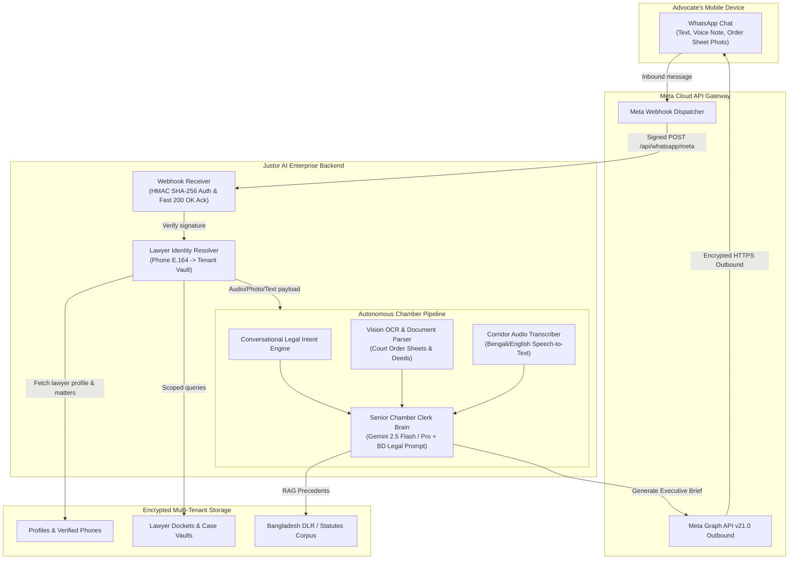
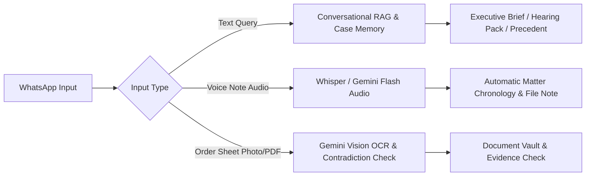

# Justor AI • Enterprise WhatsApp Chamber Intelligence Architecture & Production Plan

---

## Executive Summary

**Justor AI Mobile Chamber Assistant** transforms WhatsApp into a 24/7 autonomous legal operating system for advocates, barristers, and law chambers in Bangladesh. 

Rather than functioning as a generic customer support bot with rigid menus and static template dumps, Justor AI operates as an **Elite Senior Chamber Associate & Appellate Law Clerk**. It provides real-time docket synchronization, voice note court corridor dictation, order sheet OCR extraction, and personalized morning cause list briefings.

This document outlines the **end-to-end enterprise production plan**, spanning multi-tenant identity security, persona engineering, asynchronous webhook scalability, and production Meta Cloud API compliance.

---



---

## 1. Multi-Tenant Identity & Security Architecture

### 1.1 The Legal Privilege & Data Isolation Imperative
Under the **Canons of Professional Conduct and Etiquette (Bangladesh Bar Council)**, advocate-client communications are strictly confidential. A lawyer in Sylhet must never receive or glimpse a brief belonging to an advocate in Dhaka. 

### 1.2 Phone-to-Lawyer Identity Handshake
Every incoming webhook delivers the sender's E.164 phone number (`from`, e.g., `88017XXXXXXXX`).

```
[Inbound Sender: 88017XXXXXXXX]
       │
       ▼
Query: supabase.table("profiles").select("id, full_name, chamber_name, role, status")
       .or(f"phone.eq.+{clean_phone},whatsapp_phone.eq.+{clean_phone}")
       │
       ├───► [FOUND & VERIFIED]
       │     ├── Set Request Context: current_lawyer = { id, name, chamber }
       │     └── Restrict all DB queries strictly to: `WHERE user_id = current_lawyer.id`
       │
       └───► [UNRECOGNIZED SENDER]
             ├── DO NOT display any mock cases or chamber data!
             └── Initiate Security Onboarding Flow:
                 "আসসালামু আলাইকুম অ্যাডভোকেট সাহেব। আপনার চেম্বার নিরাপত্তা নিশ্চিত করতে অনুগ্রহ করে
                 আপনার Justor AI অ্যাকাউন্টটি লিংক করুন: [justorai.com/connect?phone=...] অথবা
                 টাইপ করুন: LINK <চেম্বার কোড>"
```

### 1.3 Web-to-WhatsApp 1-Tap Binding Workflow
1. **User Profile on Web:** Lawyer logs into `justorai.com` $\rightarrow$ Settings $\rightarrow$ Mobile Chamber Access.
2. **Phone Number Verification:** Lawyer inputs their WhatsApp number.
3. **One-Time Handshake Token:** Backend generates a cryptographically secure 6-digit alphanumeric code (`JUSTOR-789X`) valid for 10 minutes.
4. **Binding Trigger:** The lawyer clicks the direct WhatsApp link: `https://wa.me/<BOT_NUMBER>?text=LINK%20JUSTOR-789X`.
5. **Instant Authentication:** The bot verifies the token, marks `whatsapp_phone_verified = true` in Supabase, and welcomes the lawyer by name.

### 1.4 Webhook Cryptographic Verification (HMAC-SHA256)
All production endpoints must enforce Meta webhook signature validation using the app secret:
```python
def verify_meta_signature(raw_payload: bytes, hub_signature: str, app_secret: str) -> bool:
    if not hub_signature or not hub_signature.startswith("sha256="):
        return False
    signature = hub_signature.split("sha256=")[1]
    expected = hmac.new(app_secret.encode(), raw_payload, hashlib.sha256).hexdigest()
    return hmac.compare_digest(expected, signature)
```

---

## 2. Elevating Persona & Intelligence: From Robotic to Senior Chamber Associate

### 2.1 The Persona Framework
| Metric | Current Fallback (Robotic) | Enterprise Justor Chamber Associate (Production) |
| :--- | :--- | :--- |
| **Identity** | Automated Notification Bot | Senior Appellate Chamber Law Associate & Court Clerk |
| **Tone** | Mechanical, emoji dumps, rigid numbered lists | Dignified, authoritative, polished courtroom Bengali & English |
| **Legal Lexicon** | Generic labels (`মোকদ্দমা`, `ঘাটতি`) | Authentic Bangladesh legal terms (*আরজি, জবাব, রিট, তলব, তামাদি, হাজিরা, কজলিস্ট, এনেক্স কোর্ট, ধারা ১৩৮*) |
| **Prioritization** | Random database row sequence | Urgency-first (Statutory Limitation $\rightarrow$ Tomorrow's Hearing $\rightarrow$ Evidence Deficiencies $\rightarrow$ Daily To-Dos) |
| **Input Style** | Strict command codes (`STATUS JUSTOR-001`) | Free natural dialogue (*"কালকে এনেক্স ১৪-তে কি কি পেপার লাগবে?"*) |

### 2.2 System Instruction Specification (LLM Core)

```markdown
You are the Executive Legal Chamber Associate of Justor AI, serving Senior Advocates, 
Barristers, and Chamber Counsel practicing across the Supreme Court of Bangladesh 
(Appellate & High Court Divisions) and District Courts.

CORE RESPONSIBILITIES:
1. Executive Cause List & Diary Management: Proactively monitor tomorrow's court listings, 
   statutory limitation deadlines (Limitation Act 1908), and missing records.
2. File Deficiency & Contradiction Alerts: Scan client deeds, cross-examine statements, 
   and court orders to detect evidentiary gaps before the court hearing.
3. Rapid Corridor Support: Handle spoken voice notes, dictation, and order sheet photos 
   instantly, filing them into the advocate's confidential chamber vault.

COMMUNICATION PRINCIPLES:
- Address the practitioner respectfully ("শ্রদ্ধাভাজন সিনিয়র", "অ্যাডভোকেট সাহেব").
- Speak in authentic, articulate legal Bengali with precise English statutory citations.
- Structure replies for rapid mobile scanning on WhatsApp: Bold headers, short bullet points, 
  and immediate action items.
- Never invent case facts or statutory provisions. Ground all legal opinions strictly in 
  Bangladesh law (CrPC, CPC, Penal Code, NI Act, Specific Relief Act, Constitution).
```

### 2.3 Intelligent Ingestion Modes



1. **Court Corridor Voice Dictation:**
   - Advocate speaks into WhatsApp microphone: *"আজকে করিম সাহেবের মামলায় বিবাদী উপস্থিত হয়নি, কোর্ট আগামী ১৫ নভেম্বর ফাইনাল ডিসপোজালের দিন দিয়েছেন।"*
   - Transcribed via Gemini Audio / Whisper with Bangladesh court terminology tuning.
   - Automatically appends a timestamped note to the case timeline and updates next hearing date.
2. **Order Sheet Photo Vision OCR:**
   - Advocate snaps a photo of the handwriting on the judge's order sheet.
   - Gemini 2.5 Flash Vision extracts the operative order (*"বাদী পক্ষের হাজিরা গৃহীত হইল, জবাব দাখিলের জন্য শেষ সুযোগ..."*).
   - Generates an immediate executive alert on whether any adverse cost or peremptory order was made.

---

## 3. Asynchronous Webhook Architecture & Reliability

To prevent Meta timeouts (Meta drops connections after 5 seconds and resends duplicate messages), production requires an **Asynchronous Fast-Ack Architecture**:

```
[Meta Webhook POST] 
       │
       ▼
[Fast-Ack Endpoint] ── (Within 500ms) ──► Return HTTP 200 {"status": "received"}
       │
       ▼ (Pass payload to Background Task / Celery / AsyncIO Queue)
[Chamber Processing Worker]
       ├── Identify Lawyer
       ├── Fetch Scoped Matters
       ├── Execute Gemini Synthesis (< 3.5s)
       └── Send Outbound Reply via Meta Graph API v21.0
```

### Key Technical Safeguards:
- **Deduplication Cache:** Redis or in-memory LRU caching of `message.id` (`wamid.HBg...`) for 15 minutes to drop Meta duplicate delivery retries.
- **Message Truncation & Chunking:** WhatsApp Cloud API text limit is 4,096 characters. Any extensive hearing pack or legal research memo exceeding 3,800 characters is cleanly split into sequential parts with delay or exported as a clean PDF link.
- **Circuit Breaker for Model Latency:** Fallback streaming or lightweight prompt when LLM latency exceeds 4 seconds, guaranteeing a responsive user experience.

---

## 4. Production Meta WhatsApp Setup & Rollout Roadmap

### Phase 1: Identity & Multi-Tenant Engine (Week 1)
- [ ] Add `whatsapp_phone` and `whatsapp_verified` columns to `profiles` table in Supabase.
- [ ] Implement `resolve_lawyer_by_phone(sender)` in `backend/whatsapp_service.py`.
- [ ] Connect live queries to `matters` table scoped to `user_id`.
- [ ] Build the Web-to-WhatsApp Handshake Code verification flow.

### Phase 2: Persona & Generative Intelligence Upgrade (Week 2)
- [ ] Replace static string-formatting with Gemini 2.5 Flash Executive Chamber Associate prompt.
- [ ] Implement multi-turn conversational context so lawyers can ask natural follow-ups without command codes.
- [ ] Upgrade voice note transcription and vision OCR for bilingual court documents (Bengali/English).

### Phase 3: Infrastructure Hardening & Fast-Ack (Week 3)
- [ ] Implement HMAC-SHA256 signature verification for Meta webhooks.
- [ ] Decouple webhook ingestion from LLM processing using background worker tasks.
- [ ] Set up Sentry error monitoring and performance tracing.

### Phase 4: Production Meta Cloud Onboarding (Week 4)
- [ ] Acquire dedicated SIM/business phone number for Justor AI.
- [ ] Add and verify the phone number in Meta Business Manager.
- [ ] Submit official Display Name: **`Justor AI`** (Category: Professional Services).
- [ ] Upload official high-resolution logo and business description.
- [ ] Update production environment variables on Render with the live Phone Number ID.

---

## Conclusion
By shifting from a static fallback chatbot to a **secure, multi-tenant, autonomous Senior Chamber Associate**, Justor AI will deliver an indispensable, elite daily tool that every advocate in Bangladesh relies on from the moment they step into the court corridor.
