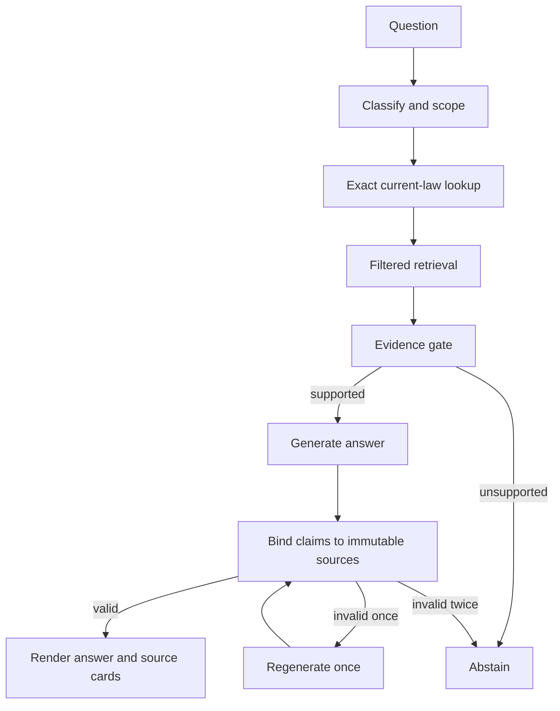

# JustorAI: Full Repository Audit and Four-Day Pilot Blueprint

**Audit date:** 10 August 2026  
**Repository:** `meidipro/JustorAi`  
**Audited commit:** `83638f2a8a2029d16c2232a1bc4f185f865f59ff`  
**Team constraint:** Taj + part-time Mehedi + AI; no dependency on Sanjib; no more than three active engineering priorities.

## Executive decision

A useful closed pilot can be ready in four days, but the product cannot honestly be presented as an A–Z Bangladesh legal adviser or as legally verified.

The right four-day product is:

1. a **citizen property and tax navigator** that answers only within a declared, current, source-backed scope;
2. a **student research view** built on the same evidence service; and
3. a **read-only lawyer MCP** for exact statute retrieval and extractive case passages.

The present repository is a promising demonstration scaffold, not a safe pilot backend. The main problem is not the language model. It is that the evidence path is not enforceable end to end:



The current code skips or weakens several of these gates. Four days should be spent fixing this path, not adding 250 cases or building broad new features.

## The three active priorities

### Priority 1 — Secure and enforce the evidence chain

This includes backend authentication, private administrative endpoints, explicit CORS, exact current-law lookup, domain gating, immutable source IDs, claim-to-source validation, and hard abstention.

### Priority 2 — Split laws and cases cleanly and ship the scoped workflows

Project A becomes the laws/amendments and application-data project. Project B becomes a backend-only case repository. Citizen property/tax workflows query laws first and normally never query cases.

### Priority 3 — Pilot telemetry and read-only lawyer MCP

Every answer gets a `query_run_id`; feedback is connected to that run. The lawyer MCP calls the same evidence service as chat and exposes only read tools during the pilot.

Everything else is paused until after the four-day pilot.

## What the repository actually contains

- Vanilla TypeScript/Vite frontend, not Next.js.
- One 1,621-line FastAPI module containing configuration, classification, retrieval, prompting, provider fallback, uploads, citation handling, logging, and public administration routes.
- Supabase/pgvector schemas with incompatible vector dimensions.
- Several incompatible ingestion paths.
- A Supreme Court crawler/extractor/staging scaffold.
- Many benchmark result files, but no current post-fix benchmark and no completed human-correctness column.
- No MCP implementation or MCP dependency.
- No committed database migrations for chat/message RLS, so tenant isolation cannot be verified from the repository.
- No meaningful automated test suite beyond a smoke script and the benchmark harness.

## Findings by severity

### P0 — launch blockers

| Finding | Evidence in repository | Consequence | Required decision |
|---|---|---|---|
| `/chat`, `/upload`, `/documents`, and document deletion have no backend authentication or role authorization | `backend/backend.py:1388–1421`, `1497–1589`, `1592–1622` | Anyone who reaches the API can consume models, upload globally searchable PDFs, list documents, or delete the corpus | Require Supabase JWT on pilot endpoints; admin-only upload/list/delete; preferably disable upload for the four-day pilot |
| CORS allows every origin with credentials | `backend/backend.py:42–49` | Any website can call the backend in a user's browser; configuration in `render.yaml` is ignored | Parse `ALLOWED_ORIGINS`; deny unknown origins |
| Frontend sends no authorization token and backend trusts caller-supplied `user_id` | `src/pages/app.ts:870–888`; `backend/backend.py:1521` | Identity and telemetry can be spoofed; rate limits and row ownership cannot be enforced | Derive user ID from verified JWT, never from JSON |
| Markdown is inserted with `innerHTML` without sanitization | `src/pages/app.ts:915–920` | A malicious model response or source can execute browser script; saved output can become persistent XSS | Sanitize with DOMPurify before rendering and on replay |
| Exact Act+section lookup uses substring matching | `backend/backend.py:885–903`, `958–968` | Section 4 can match 14, 40, or 54; similar Act titles collide | Use canonical `act_id` and exact `section_canonical` equality |
| Section mismatch is explicitly allowed to answer | `backend/backend.py:1045–1056` returns `(True, "section_not_exact")` | The advertised hard-abstention safeguard does not exist for one of the highest-risk failures | Return invalid and abstain/regenerate when exact evidence was requested but absent |
| Case/DLR vector search runs for every query | `backend/backend.py:977–984` | Irrelevant case law contaminates statute and personal-law answers, including the Q17/Q46 class | Query cases only when the route explicitly requires case law; never for the default citizen route |
| Citation verification is effectively a no-op | Source objects use `act` at `1094`; verifier asks for `act_name` at `1467` | It normally skips verification entirely | Replace the function; do not patch this key and call it claim validation |
| Invalid citation handling silently removes a tag | `backend/backend.py:1490–1495` | Unsupported legal prose remains and appears cleaner; this launders hallucinations | On validation failure, regenerate once; then abstain. Never silently detach a legal claim from its evidence |
| Vector dimensions conflict | laws schema is `vector(768)`; Supreme Court staging is `vector(1024)`; runtime uses BGE-M3 | Queries/inserts can fail or different embeddings can be incomparable | Choose one embedding model and dimension; create dimension-specific tables/indexes and record the model/version |
| Supreme Court promotion targets the law table with incompatible semantics | `tools/review_staging.py` maps case number to `act_name`, page to `section_number`, and omits required `document_id` | Promotion can fail or corrupt the statutory corpus | Delete the promotion path after preserving evidence; promote only within Project B case tables |
| Product claims document security/capabilities that the implementation does not provide | `src/pages/doc-analysis.ts` and public UI copy | Pilot users and investors can be misled; upload implementation is global, not private | Hide the page or replace it with an honest “not in pilot” notice |

### P1 — must fix for useful results

| Finding | Consequence | Fix |
|---|---|---|
| `_filter_blocked_acts` returns the original set when filtering removes everything | Wrong-religion or wrong-domain law can leak back into the answer | Empty filtered result must remain empty and trigger abstention |
| Neighbor windowing adds chunks after filtering without rechecking status, Act, jurisdiction, or version | Dead or unrelated law can be reintroduced | Disable in the pilot or enforce same document/version/status and re-run all gates |
| “Current law” is inferred from a loose text status and defaults missing status to Active | Superseded or unverified text can be treated as current | Add effective dates, legal status, verification status, source hash, and `as_of` evaluation |
| Classifier is partly LLM-driven and partly benchmark-specific regex | Routing is non-reproducible and overfits test questions | Use deterministic route detection first; model only fills missing structured fields; validate its output |
| Citizen prompt demands practical authorities/helplines not supplied as evidence | The model is pushed to invent procedural facts | Put verified service information in a controlled source table or omit it |
| Citizen “Act purity” discourages necessary adjacent statutes | Property matters often require TPA + Registration + tenancy/land statutes | Use an explicit, versioned adjacency graph; do not use a blanket secondary-Act ban |
| Source responses omit immutable source IDs, raw supporting text, and official URLs | The frontend cannot show auditable evidence cards | Return `source_id`, official URL, page/section, text span, status, and effective date |
| Raw exception strings are sent to users | Internal provider/database details can leak | Log an error ID server-side; return a generic public message |
| Query logging is synchronous inside the async request and stores caller-controlled identity | Avoidable latency and unreliable evidence | Async logging or background queue; JWT identity; return `query_run_id` |
| Feedback is not linked to the generated retrieval/model run | Investor dashboard cannot explain failures | Store feedback by `query_run_id` with reason codes |
| Database policies named for service role use `USING (true)` without a role qualifier | Depending on grants, policies may unintentionally apply broadly | Use `TO service_role`; deny direct anonymous access; verify grants and RLS with tests |

### P2 — after the pilot

- Complete OAuth 2.1 authorization for a public remote MCP.
- Broader tax computation and individualized tax planning.
- Case ratio/holding extraction with legal editorial review.
- Private document analysis and tenant-isolated document RAG.
- Bulk ingestion of 250 recent cases.
- Full historical case review.
- A proper legal ontology, cross-citation graph, reranker, and multilingual evaluation suite.
- Billing, plans, and usage entitlements.

## Security verdict, including `VITE_GROQ_API_KEY`

The earlier statement that the current frontend bundle definitely exposes Groq is not supported by this commit. The frontend calls FastAPI and does not import Groq. However:

- the README still instructs deployment with `VITE_GROQ_API_KEY`;
- the backend still accepts `VITE_GROQ_API_KEY` as a fallback; and
- the frontend package still describes Groq as a frontend dependency/capability.

Therefore the fix is:

1. remove every `VITE_GROQ_API_KEY` and other private provider-key instruction;
2. accept only `GROQ_API_KEY` in the backend;
3. inspect the deployed JavaScript bundle and hosting variables;
4. rotate the Groq key if it was ever deployed with a `VITE_` prefix; and
5. add a CI secret-string/build scan.

This is important, but the unauthenticated upload/delete/API surface and XSS risk are the confirmed security blockers in the checked commit.

## Retrieval and orchestration: present behavior versus required behavior

### Present behavior

1. `classify_query()` asks a model for structured intent and adds regex/keyword anchors.
2. The query is embedded using OpenRouter/BGE-M3.
3. A fuzzy exact lookup runs when Act and section were detected.
4. Vector Act retrieval runs with a low threshold (`0.22`).
5. Dead-law rows are filtered by a small status denylist.
6. Domain filtering can fall back to the unfiltered rows.
7. DLR search always runs.
8. Neighbor chunks are added after the main filters.
9. A section mismatch remains a valid retrieval.
10. The model writes `[ACT-N]`/`[DLR-N]` tags.
11. The backstop normally skips citation checks due to the `act`/`act_name` key mismatch.
12. The footer formats cited source labels, but does not prove a claim is supported.

### Required pilot behavior

```text
normalize query
→ deterministic product-scope router
→ structured fact extraction
→ missing-critical-fact question
→ canonical Act/section resolution
→ exact current version lookup
→ filtered lexical/vector fallback only if exact lookup is not applicable
→ case retrieval only when route and persona permit it
→ evidence sufficiency gate
→ generate only from EvidenceItem IDs
→ validate every legal claim's Act + section + source + support span
→ regenerate once on failure
→ abstain on second failure
→ render official source cards
→ record query_run_id and feedback
```

The system must fail closed. Empty evidence after filtering is a valid outcome, not a reason to restore the unsafe candidates.

## The evidence contract

Both databases must return the same application-level shape:

```python
class EvidenceItem(TypedDict):
    source_id: str               # immutable, globally unique
    source_type: Literal["law", "case"]
    jurisdiction: str            # BD
    title: str
    act_id: str | None
    section_canonical: str | None
    case_id: str | None
    page_start: int | None
    page_end: int | None
    legal_status: str | None
    effective_from: date | None
    effective_to: date | None
    official_url: str
    source_hash: str
    text: str
    support_span: str
    extraction_status: str
```

The model may refer only to stable IDs such as `SOURCE_1`. The backend maps `SOURCE_1` to an immutable `source_id` after validation. The model must never invent a public citation tag.

Minimum citation validation for the four-day pilot:

- referenced `SOURCE_n` exists in the supplied evidence;
- Act identity matches;
- directional section match is correct;
- every requested section is present, not only one of a list;
- current-law/effective-date gate passed;
- the sentence's material legal terms occur in or are entailed by the supporting span;
- otherwise regenerate once and then abstain.

For the narrow pilot, an extractive or templated answer is preferable to an elaborate semantic claim judge.

## Correct directional section matching

| Expected | Claimed | Result |
|---|---|---|
| `96` | `96(1)` | Match: the general expected section includes a specific subsection |
| `96(1)` | `96(2)` | Fail |
| `190(1)(b)` | `190` | Incomplete |
| `53B` | `53` | Fail |
| `3, 4, 5` | only `3` | Incomplete |
| `73, 74` | only `73` | Incomplete |

The current harness reduces both expected and claimed references to a base section. It therefore still produces false positives for several rows in this table.

## Benchmark verdict

The parser fix exists in source: `CITATION_TAG_RE = re.compile(r"\[(?:ACT|DLR)-\d+\]")`, and `run_all_checks()` now populates `citations_found`.

But the committed result evidence does not demonstrate the fix:

- `benchmark_results_50.csv`: 49 rows, `citations_found=[]` in all 49, human fields blank in all 49.
- `benchmark_results_pilot_launch_v16_final.csv`: 45 rows, `citations_found=[]` in all 45, human fields blank in all 45.
- V16 uses `justor benchmark verified 45.csv`, while several corrections were made in another 50-row file.
- Q37 still has slash-separated primary Acts instead of a primary/acceptable-secondary schema.
- Q050's expected Act was changed, but its category remains poisoned.
- Additional gold-answer anomalies remain.

Consequences:

- There is **no trustworthy new accuracy number** in the repository.
- The former 93.9% is a safety-check pass rate produced with broken evidence, not legal accuracy.
- The 34.7% figure remains the last credible strict assessment described in the project discussion, but it is not represented by populated human columns in these committed files.
- Automated checks should be reported as `retrieval/citation safety checks`, never as legal correctness.

### Four-day regression suite

Freeze 30 questions before coding begins:

- 8 supported property questions;
- 7 supported tax-navigation questions;
- 10 unsupported/high-risk questions that must abstain; and
- 5 adversarial contamination questions, including Hindu/Muslim inheritance separation, defamation cognizability, omitted/repealed law, an exact subsection mismatch, and a foreign-jurisdiction prompt.

Pass conditions:

- every displayed legal proposition links to an existing immutable source;
- requested exact section is retrieved or the system abstains;
- no repealed/omitted/superseded law is presented as current;
- no case result appears in citizen mode unless explicitly approved by the route;
- no wrong-personal-law contamination;
- auth and RLS prevent cross-user access;
- sanitized rendering defeats a stored/prompted XSS payload;
- every response and abstention returns a `query_run_id`.

Do not set an arbitrary target such as “15–20% abstention.” The correct abstention rate is determined by the scope and evidence. On the 10 unsupported questions it should be 100%; on the 15 supported questions it should be low.

## Two-Supabase implementation

Supabase currently grants two free projects and a 500 MB database quota per free project. A free project can enter read-only mode above 500 MB. Before migration, measure each table and index; export counts and hashes; reclaim headroom carefully. Deleting rows does not necessarily reclaim physical space immediately.

### Project A — `justor-core-laws`

Purpose: laws, amendments, authoritative versions, application identity, chats, pilot runs, and feedback.

Core legal tables:

| Table | Required fields |
|---|---|
| `acts` | `act_id`, canonical title, aliases EN/BN, Act number/year, jurisdiction, official URL |
| `law_versions` | `version_id`, `act_id`, publication/effective dates, `effective_to`, `legal_status`, source hash, verification status |
| `law_sections` | `source_id`, `version_id`, exact canonical section, subsection path, heading, text, page/anchor, embedding, embedding model/dimension, text hash |
| `law_amendments` | amending instrument, affected Act/section, operation, old/new version IDs, effective date |
| `official_notices` | authority, notice/SRO/rule type, issue/effective dates, official URL, source hash |

Product tables:

| Table | Purpose |
|---|---|
| `profiles` | persona and consent flags, keyed to Supabase Auth UID |
| `chats` / `messages` | tenant-isolated product history |
| `query_runs` | reproducible retrieval/model/prompt trace |
| `answer_feedback` | helpful/not helpful plus structured failure reason |

Rules:

- The frontend sees only Auth and its own product rows through RLS.
- Legal retrieval is served through the backend; the service-role key never reaches the browser.
- Reserve at least 50–100 MB headroom for indexes, logs, and maintenance.
- Export and verify case/DLR rows before removing them from Project A.
- Because the current project is reportedly at the quota, do not assume feedback writes will work until database size and read-only state are checked.

### Project B — `justor-cases`

Purpose: cases only. No chats, profiles, or citizen product data.

| Table | Required fields |
|---|---|
| `cases` | `case_id`, court/division, case number/year, parties, judgment date, judges, official PDF URL, PDF hash, extraction/review status |
| `case_chunks` | `source_id`, `case_id`, page range, chunk index, exact text, text hash, embedding model/dimension, quality score, `auto_extracted` |
| `case_authorities` | cited Act/section/case strings with page and extraction confidence |
| `ingestion_runs` | code/model versions, manifest/hash counts, inserted/failed counts, timestamps |

Rules:

- Backend service access only; no Project B key in the browser.
- Do not move the raw Supreme Court PDFs into Postgres. Keep the official URL and content hash; mirror later only if licensing, storage, and integrity are resolved.
- In the pilot, expose auto-extracted page passages, not AI-written holdings or ratio decidendi.
- Keep the current 26 cases as a controlled corpus. Do not add 250 until ingestion idempotency, quality flags, and search behavior pass regression.

### Backend composition

```python
laws_db = create_client(LAWS_SUPABASE_URL, LAWS_SUPABASE_SERVICE_KEY)
cases_db = create_client(CASES_SUPABASE_URL, CASES_SUPABASE_SERVICE_KEY)

laws = LawsRepository(laws_db)
cases = CasesRepository(cases_db)
evidence = EvidenceService(laws=laws, cases=cases)
```

There are no cross-project database joins. FastAPI queries each repository and combines `EvidenceItem` objects. Citizen requests normally query Project A only. Lawyer `search_cases` may query Project B; a lawyer authority bundle may query both.

### Migration order

1. Measure Project A by table/index and confirm vector dimensions and read-only state.
2. Export a manifest with row count, primary key, and content hash for every case/DLR/staging row.
3. Create Project B schema with the chosen embedding dimension.
4. Copy only case records and chunks; validate count and hash.
5. Switch case retrieval to Project B behind a repository interface.
6. Run shadow comparisons on the frozen queries.
7. Only after validation, remove duplicate/case structures from Project A and reclaim space safely.
8. Create Project A application telemetry and law-version tables with preserved headroom.

No destructive migration should happen without the exports and comparison report.

## Embeddings and ingestion

The repository currently mixes at least three incompatible ingestion contracts:

- Gemini 768-dimensional embeddings in `ingest_v2.py` and the main law schema;
- BGE-M3 1024-dimensional embeddings in the running backend and Supreme Court staging; and
- Qwen-based paths in generic/DLR ingestion scripts with different metadata behavior.

The fix is a single configuration record:

```text
EMBEDDING_MODEL = <one exact provider/model identifier>
EMBEDDING_DIM = <one exact integer>
EMBEDDING_VERSION = <internal migration version>
```

For a clean BGE-M3 design, use 1024 dimensions throughout new law and case tables. Do not change a live `vector(768)` column in place without a staged migration. Re-embed into new tables, compare counts/queries, then switch.

Every ingest row requires:

- canonical source ID;
- official URL;
- source file hash and text hash;
- extraction method/version;
- embedding model/dimension/version;
- legal/effective status;
- inserted/updated timestamps; and
- idempotent uniqueness constraints.

### Supreme Court pipeline defects to fix before scaling

- Cached-download branch references an undefined `filename`.
- Pagination stops when a page contains no new records, which can prevent reaching later pages.
- Parsed Act/section regex loses structure in some Order/Rule references.
- Only the first ten pages of a case are ingested.
- Page chunks have no overlap or legal-semantic segmentation.
- Local manifest is marked `STAGED` even when every remote insert fails.
- HTTP embedding responses are not consistently checked before parsing.
- There is no idempotent upsert or source-hash uniqueness.
- The promotion tool writes cases into the statutory table with incorrect columns.

For the four-day pilot, fix the cached-download exception, failure state, idempotency, and Project B target. Keep the existing 26-case corpus. Defer bulk crawling.

## Citizen pilot scope

### Property navigator — supported in the pilot

The official Judiciary land-law portal identifies a multi-Act property stack, including the State Acquisition and Tenancy Act 1950, Transfer of Property Act 1882, Registration Act 1908, Non-Agricultural Tenancy Act 1949, and Land Reforms Act 2023. Therefore property cannot be implemented as a single-Act classifier.

Supported workflows after their statutes are current and ingested:

1. sale/gift/mortgage legal-formality explanations;
2. registration and document checklist;
3. non-agricultural tenancy rights/process overview;
4. title, deed, mutation, khatian, possession, and tax-record concept explanation;
5. pre-emption and land-ceiling issue spotting at a general level; and
6. “what documents/facts do I need before speaking to the authority/lawyer?”

Required intake fields:

- transaction/issue type;
- land/property type;
- deed type and registration status;
- mutation/record status;
- possession state;
- relevant dates;
- district/local authority; and
- desired action.

Hard-abstain or escalate:

- title/opinion on uploaded documents;
- predicting a dispute or court outcome;
- limitation/deadline advice without exact current authority and dates;
- inheritance shares or religious personal law during the four-day pilot;
- vested property, acquisition/compensation, waqf, complex partition litigation, or overlapping proceedings; and
- any answer for which the required statute/version is absent.

The repository's 1976 land development tax ordinance data is not enough to make a current land-tax claim. It must be checked against the current legislative framework before it is pilot-approved.

### Tax navigator — supported in the pilot

The tax corpus must be date-versioned. Current NBR sources include the Income Tax Act 2023 and 2025 amending instruments, Finance Act 2026, and Withholding Tax Rules 2026 plus its July 2026 amendment. A static Income Tax Act embedding cannot support current A–Z tax advice.

Supported workflows:

1. taxpayer/filer classification and missing-fact intake;
2. return-filing process and official document checklist;
3. explaining a cited current provision in plain language;
4. identifying which official Act/rule/SRO/notice likely controls; and
5. deterministic examples only where the exact current rate table and assessment year are stored and tested.

Required intake fields:

- assessment year and transaction/income date;
- individual/company/other taxpayer type;
- residence status;
- income category;
- approximate range, when relevant; and
- requested task: filing, withholding, computation, document list, or explanation.

Hard-abstain or escalate:

- personalized tax minimization strategy;
- final liability for businesses or multi-source/foreign income;
- VAT, customs, transfer pricing, withholding edge cases, penalties, or pending disputes;
- any rate or threshold without an explicit assessment year/current instrument; and
- user action with a near deadline unless the exact official source and date are verified.

This positioning is still useful: “Justor guides you to the current rule, asks the necessary facts, gives a checklist, and shows its sources.” It is not “Justor is your tax lawyer.”

## Law-student mode

Use the same evidence service and answer gate. Student mode may add:

- plain-language section breakdown;
- comparison of current and former wording;
- definitions and cross-references; and
- official case-page excerpts labeled `auto-extracted`.

It must not turn unreviewed page text into an asserted ratio or precedent hierarchy. Show the official PDF, page number, extraction quality, and warning that the excerpt has not been editorially verified.

## Lawyer MCP pilot

No MCP implementation exists in the repository. Build it as a thin adapter over the same application services, not a second retrieval system.

### Read-only pilot tools

| Tool | Purpose | Database |
|---|---|---|
| `get_law_section(act_id, section, as_of_date)` | Exact current/historical section and source metadata | A |
| `search_laws(query, act_ids?, as_of_date?, limit?)` | Filtered statute/rule search | A |
| `compare_law_versions(act_id, section, from_date, to_date)` | Amendment/version comparison | A |
| `search_cases(query, court?, date_range?, act_id?, section?, limit?)` | Return case metadata and ranked passages | B |
| `get_case_passage(case_id, page_start, page_end)` | Exact official-page extract | B |

Do not expose draft-pleading generation, outcome prediction, writes, deletion, ingestion, user data, or raw service-role access in the pilot.

### Transport and authorization

- Use the official Python MCP SDK and the current Streamable HTTP transport at a single `/mcp` endpoint.
- For the four-day closed test, keep the endpoint private and use short-lived, scoped internal credentials or a local `stdio` server.
- Do not publish an unauthenticated remote MCP.
- Before external connector use, implement the MCP authorization requirements: OAuth 2.1 resource-server behavior, protected-resource metadata/discovery, audience validation, least-privilege scopes, HTTPS, and no token passthrough.
- Validate with MCP Inspector and contract tests.

Suggested scopes after the pilot:

```text
justor:laws:read
justor:cases:read
justor:versions:read
```

## Feedback and investor evidence

The current “helpful” interaction is not enough. It does not show which retrieval, prompt, model, or evidence set produced the answer.

### `query_runs`

Store:

- UUID `query_run_id` returned to the client;
- authenticated user/session ID;
- persona and workflow;
- consent-aware query text or hash;
- extracted domain, Act, section, assessment/as-of date, and risk route;
- laws/case source IDs;
- retrieval status and abstention reason;
- prompt/retrieval/model/embedding version;
- latency and error category; and
- created time.

### `answer_feedback`

Store:

- `query_run_id` and authenticated user ID;
- helpful yes/no;
- reason: `wrong_law`, `wrong_section`, `outdated`, `citation_mismatch`, `missing_information`, `unclear`, `too_cautious`, or `other`;
- optional note; and
- timestamp.

### Honest investor/grant dashboard

Show:

- invited, activated, and returning testers;
- completed supported workflows;
- source-card opening rate;
- helpful-answer rate and reasons;
- abstention rate by supported/unsupported scope;
- median latency and errors;
- lawyer MCP tool calls; and
- examples of issues discovered and fixed.

Do not label these metrics “legal accuracy.” Report a scoped retrieval-safety pass rate separately from manually assessed legal correctness.

## Four-day execution map

### Day 1 — shut the dangerous doors and define the contract

**Mehedi**

- Add JWT middleware and derive identity server-side.
- Restrict CORS to production and preview origins.
- Disable or admin-protect upload/list/delete/status endpoints.
- Remove all `VITE_GROQ_API_KEY` instructions/fallbacks; inspect deployed bundle; rotate if previously exposed.
- Add rate limits and generic public errors.
- Add DOMPurify to all rendered and replayed Markdown.
- Define `EvidenceItem`, `query_run_id`, and the safe answer/abstention response schema.

**Taj**

- Freeze the pilot promise and unsupported list.
- Prepare 15 supported property/tax questions, 10 must-abstain questions, and five adversarial questions.
- Remove/hide unimplemented document-security, “Pro plan,” and broad capability claims from demo copy.

**AI**

- Build the primary-source manifest and current-version checklist.
- Normalize Act aliases and exact section test fixtures.
- Review each frozen expected answer against authoritative text and label it `AI source-checked`, not `lawyer-verified`.

**Exit gate**

- No unauthenticated mutation/admin route.
- No provider secret in client bundle/instructions.
- XSS test passes.
- Response contract and frozen tests committed.

### Day 2 — two projects and deterministic evidence retrieval

**Mehedi**

- Create `LawsRepository`, `CasesRepository`, and `EvidenceService`.
- Measure Project A, confirm read-only state, and migrate the existing controlled case set to Project B using count/hash checks.
- Lock one embedding model/dimension for new tables.
- Implement canonical Act IDs and exact section lookup.
- Implement effective-date/current-law filters.
- Stop default DLR retrieval; remove unsafe filter fallbacks; disable or revalidate neighbor windowing.
- Make section mismatch fail closed.

**Taj**

- Verify the 4-day UI workflow and source-card wording.
- Create the invite list: two lawyers, two students, one citizen for the first controlled wave.

**AI**

- Compare old/new retrieval on the frozen set.
- Validate source hashes, statuses, and version dates.
- Flag any question whose controlling instrument is absent.

**Exit gate**

- Citizen queries never reach Project B by default.
- Exact requested sections either resolve exactly or abstain.
- Wrong religion/domain and dead-law contamination tests pass.

### Day 3 — answer guard, citizen workflows, MCP, and feedback

**Mehedi**

- Replace citation stripping with source-ID binding, claim validation, one regeneration, then abstention.
- Add structured property/tax intake and route whitelists.
- Return official source cards and `query_run_id`.
- Add feedback endpoint/table and reason codes.
- Add read-only MCP tools using the same evidence service; keep it private/internal.

**Taj**

- Complete the 10-minute demo script: citizen property, citizen tax, student explanation, lawyer MCP, feedback dashboard.
- Draft the participant consent and feedback questions.

**AI**

- Source-check generated demo answers and failure messages.
- Run adversarial prompts and citation/source consistency checks.

**Exit gate**

- No displayed citation can refer to a missing source.
- Unsupported claims regenerate once and then abstain.
- Feedback is connected to a reproducible query run.
- MCP is read-only and cannot expose user data or mutation tools.

### Day 4 — regression, deploy, controlled pilot

**Mehedi**

- Run syntax/unit/contract, auth/RLS, XSS, retrieval, and MCP Inspector tests.
- Run the frozen 30-question benchmark with the corrected harness and versioned fixture.
- Verify production CORS, tokens, logs, bundle secrets, rate limits, and failure behavior.

**Taj**

- First run internally; then invite the five controlled testers.
- Observe tasks and collect feedback rather than explaining the product during every step.
- Record use cases, confusion, source trust, and willingness to return/pay/recommend.

**AI**

- Compare actual outputs with source text and regression expectations.
- Produce a pilot summary separating safety checks, user feedback, and unverified legal correctness.

**Go/no-go gates**

- `0` browser provider secrets.
- `0` unauthenticated upload/delete/admin routes.
- `0` cross-user data-access failures.
- `0` fabricated source IDs in the frozen test.
- `100%` abstention on unsupported frozen questions.
- `100%` feedback attached to a `query_run_id`.
- At least `90%` correct routing and exact-source retrieval on the scoped frozen set.
- No public claim of broad legal accuracy.

If a gate fails, keep the pilot private and fix that class before adding users.

## Product language for the four-day pilot

Use:

> JustorAI is a source-backed Bangladesh legal information navigator. In this pilot it helps with selected property and income-tax workflows, shows the current official sources it used, and says when its verified evidence is insufficient.

Avoid:

- “A–Z legal solution”;
- “lawyer-verified”;
- “93.9% accurate”;
- “complete Bangladesh law database”;
- “secure document analysis”; and
- “AI lawyer.”

Calling AI source comparison “lawyer research” does not make it legal verification. For an internal discovery pilot, AI can do primary-source comparison and adversarial QA. For public reliance, filings, deadlines, tax liability, or case strategy, qualified legal review remains necessary. This is a product-positioning and evidence-integrity boundary, not a reason to delay the controlled pilot.

## Stop-doing list

For the next four days:

- do not ingest 250 new cases;
- do not promote unreviewed cases into the law table;
- do not build full historical review;
- do not tune to an arbitrary abstention percentage;
- do not build broad tax calculations;
- do not activate private-document analysis;
- do not add another LLM or embedding provider;
- do not report automated clean-rate as legal accuracy;
- do not publish the MCP without proper authorization; and
- do not refactor the entire frontend.

## Immediate file-level work queue

| Order | File/module | Change |
|---:|---|---|
| 1 | `backend/backend.py` | Auth, CORS, rate limit, disable admin endpoints, remove unsafe exact lookup/DLR path/citation verifier |
| 2 | new `backend/services/evidence.py` | Evidence contract, gates, claim/source validation |
| 3 | new `backend/repositories/laws.py` and `cases.py` | Separate Supabase clients and exact/hybrid retrieval |
| 4 | new versioned SQL migrations | Project A/B schemas, constraints, RPCs, RLS, telemetry |
| 5 | `src/pages/app.ts` | JWT header, sanitized Markdown, source cards, `query_run_id`, feedback reasons |
| 6 | UI routing/copy | Property/tax structured workflow; hide unimplemented claims |
| 7 | benchmark harness and one frozen fixture | Directional/multi-section match, post-fix evidence, separate safety from correctness |
| 8 | Supreme Court tools | Project B target, downloader/pagination/failure/idempotency fixes |
| 9 | new `backend/mcp_server.py` | Private read-only MCP adapter over evidence service |
| 10 | README/deploy config | Correct architecture, secrets, environment variables, test/deploy commands |

## Definition of “usable in four days”

Usable means a closed, observable product-research pilot in which the system:

- securely identifies users;
- handles a narrow property or tax-navigation task;
- retrieves exact, current, official source text;
- answers conservatively or abstains;
- exposes the supporting source;
- gives lawyers read-only research tools;
- collects reproducible feedback; and
- produces honest traction and failure data.

It does not mean the whole repository is perfected or broad Bangladesh legal advice is production-ready. That distinction is what makes the four-day plan achievable.

## External primary references

- [Supabase free-project and database quotas](https://supabase.com/docs/guides/platform/billing-on-supabase)
- [Supabase database size and read-only behavior](https://supabase.com/docs/guides/platform/database-size)
- [MCP transports: stdio and Streamable HTTP](https://modelcontextprotocol.io/specification/2026-07-28/basic/transports)
- [MCP authorization](https://modelcontextprotocol.io/specification/2026-07-28/basic/authorization)
- [MCP authorization security considerations](https://modelcontextprotocol.io/specification/2026-07-28/basic/authorization/security-considerations)
- [NBR Income Tax Acts](https://nbr.gov.bd/regulations/acts/income-tax-acts/eng)
- [NBR Finance Acts, including Finance Act 2026](https://nbr.gov.bd/regulations/acts/finance-acts/eng)
- [NBR Income Tax Rules, including Withholding Tax Rules 2026](https://nbr.gov.bd/regulations/rules/income-tax-rules/eng)
- [Bangladesh Judiciary land-related laws](https://judiciary.gov.bd/en/menu/page/land-related-laws)

