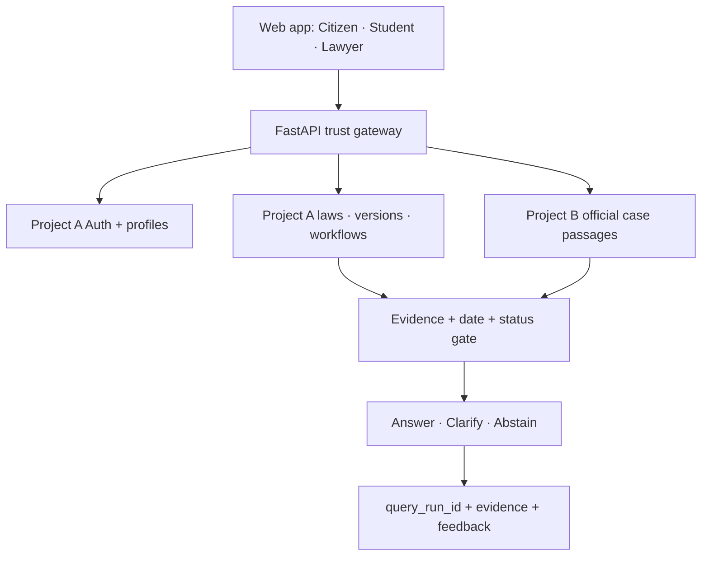

# Justor AI — A–Z Pilot Implementation Command Center

**Prepared for:** Tajuddin Ahamed and the Justor AI team  
**Prepared:** 10 August 2026  
**Pilot:** Citizen Property + Income-Tax Navigation · Lawyer/Student Research · 100 Official Cases · Three Private MCP Tools  
**Delivery window:** Five-day pilot opening, followed by a controlled 2–3 week expansion

---

## 1. Executive decision

Justor can open a small closed pilot in five days if the team builds a narrow,
evidence-controlled product and refuses to confuse ingestion with verification.

The Day-5 product should contain:

- one Supabase Auth system with Citizen, Law Student, and Lawyer modes;
- Citizen Mode limited to source-checked property and income-tax workflows;
- Lawyer Web Mode with exact statute search and official page-level judgment
  passages;
- Student Mode with statute explanation and clearly labelled case excerpts;
- Project A for laws, users, workflows, amendments, telemetry, and feedback;
- Project B exclusively for cases;
- 100 official Supreme Court PDFs technically ingested into Project B;
- three private MCP tools over the same backend evidence service;
- claim-bound citations, current-law gates, clarification, and abstention;
- a Day-5 smoke pilot with 2 lawyers, 3 students, and 5 citizens;
- closed-pilot recruitment after the smoke test passes.

The product must not promise “zero hallucination.” No general-purpose LLM can
honestly guarantee that. Justor can enforce a more useful engineering promise:

> Unsupported legal answers never reach the user. The system either shows an
> approved, source-linked answer, asks for missing facts, or abstains.

That is the trust contract.

---

## 2. What has and has not been executed

Completed in this implementation pack:

- repository audit against commit `83638f2`;
- official source strategy for property, tax, and Supreme Court judgments;
- additive Project A and Project B migrations;
- exact section, case-routing, evidence, quote, and citation contracts;
- regression tests for Section 4 vs 40, citizen case blocking, quote binding,
  and whitelist enforcement;
- evidence-bound Justor Brain prompt;
- initial official property/tax source manifest;
- complete workflow, role, amendment, case, feedback, advisor, and rollout plan.

Not executed because this workspace has no authenticated live Supabase or
deployment access:

- the live vector-dimension query;
- database migrations;
- creation of Project B;
- downloading and indexing the 100 PDFs;
- deployment or external announcement.

Mehedi must run the supplied live-audit SQL first. The team must not assume 768
or 1024 from repository files.

---

## 3. Final system architecture



### Project A — `justor-core-laws`

Use it for:

- Supabase Auth;
- profiles and verified roles;
- existing broad law corpus;
- canonical Acts, aliases, provisions, and versions;
- citizen-approved provision whitelist;
- guided workflows and approved answer cards;
- changeable tax/property parameters;
- amendment instruments and mutation operations;
- chats, query runs, evidence records, and feedback;
- advisor profiles and logged legal-review events.

### Project B — `justor-cases`

Use it only for:

- official case metadata;
- official listing and PDF URLs;
- SHA-256 and byte size;
- every usable PDF page;
- native/OCR extraction provenance;
- page-level and page-bounded chunks;
- hybrid search embeddings and lexical index;
- extracted statute/case citations;
- optional lawyer-reviewed passage labels.

Project B has no app users, no public RLS policy, and no frontend credentials.
Only FastAPI and offline ingestion jobs receive its service credential.

### Embedding contract

- Audit Project A before selecting its query embedding model.
- Align the runtime query model with the live Project A column and stored rows.
- Project B is new and may use BGE-M3 at 1024 dimensions.
- Retrieve separately in each project, then merge evidence objects as text and
  metadata. Vectors never cross project boundaries.
- Record `embedding_model`, `embedding_dimension`, and pipeline version on every
  ingestion run.

---

## 4. The A–Z implementation sequence

| Letter | Action | Completion evidence |
|---|---|---|
| A | Audit Project A vectors, storage, statuses, and duplicates | Saved SQL output |
| B | Back up data and freeze commit | Export hash + Git tag |
| C | Create Project B | Backend-only case project |
| D | Define one embedding contract per project | Config + dimension test |
| E | Establish legal source registry | Official URL + hash + date |
| F | Freeze Citizen pilot whitelist | Approved property/tax provisions |
| G | Generate guided workflows | 12 supported workflow cards |
| H | Harden authentication and RLS | User-isolation tests pass |
| I | Ingest 100 official cases | 100 manifests + hashes + pages |
| J | Join evidence to query runs | 100% traceability |
| K | Keep cases out of Citizen Mode | Routing regression passes |
| L | Launch Lawyer and Student web modes | Role authorization passes |
| M | Mount three private MCP tools | Inspector test passes |
| N | Normalize Act aliases and sections | Exact lookup passes |
| O | Operate amendment queue | Reviewed mutation transaction works |
| P | Produce citations in backend | No model-created source tags |
| Q | Question users when facts matter | Clarification tests pass |
| R | Refuse unsupported/dead/conflicting law | Abstention tests pass |
| S | Sanitize output and lock CORS | Security checks pass |
| T | Track server-side feedback and errors | Dashboard query works |
| U | Usability-test with 10 people | Smoke-test report |
| V | Verify source links and PDF pages | Link checker report |
| W | Work with five named advisors honestly | Consent + review logs |
| X | eXecute 50-question and 200-query tests | Gate report |
| Y | Yield pilot metrics for iDEA | Evidence pack |
| Z | Zoom from 10 to 160 users in waves | Expansion gates remain green |

---

## 5. One sign-in system, three pillars

Do not build three separate authentication systems. Use one Supabase Auth user
and a server-side profile.

### Signup

Ask for:

- display name;
- email;
- password or magic link;
- requested role: Citizen, Law Student, or Lawyer;
- preferred language: Bangla or English;
- pilot/research consent.

Do not ask ordinary users for sensitive legal facts during signup.

### Role rules

| Requested role | Immediate access | Verification |
|---|---|---|
| Citizen | Citizen Mode | None beyond email |
| Law Student | Student + Citizen Mode | Self-declared during pilot |
| Lawyer | Citizen/Student while pending; Lawyer Mode after approval | Manual professional verification |

The frontend may request a mode, but the backend derives permissions from the
verified JWT user and `profiles.verified_role`. It never trusts `user_id` or
role sent in a JSON body.

### Lawyer verification

For the closed pilot, Taj manually verifies:

- full professional name;
- chamber/firm or institutional affiliation;
- professional evidence appropriate to the pilot;
- consent to the pilot terms.

Store only the minimum evidence required. Do not expose private verification
documents on the website.

### Frontend request

```typescript
const { data: { session } } = await supabase.auth.getSession();

await fetch(`${backendUrl}/api/v1/chat`, {
  method: 'POST',
  headers: {
    'Content-Type': 'application/json',
    Authorization: `Bearer ${session?.access_token}`,
  },
  body: JSON.stringify({
    message,
    active_mode: selectedMode,
    conversation_id: activeConversationId,
  }),
});
```

No `user_id` is sent. FastAPI verifies the token and obtains the user ID.

---

## 6. Citizen Mode is guided first, chat second

Citizen Mode should open with two large choices:

1. Property and land
2. Income tax

Each opens workflow cards. Free-text chat remains available, but its first job
is to route the person into a supported workflow—not to write a legal opinion.

### Citizen decision states

```text
SUPPORTED + complete facts + approved card → ANSWER
SUPPORTED + missing material fact          → CLARIFY
OUTSIDE scope / no current evidence         → ABSTAIN
```

Citizen answers are assembled from reviewed answer cards and exact sources.
The LLM may classify and simplify language; it does not invent the legal prose.

### Mandatory answer display

Every citizen result shows:

- “What this means”;
- “What the verified source says”;
- practical next steps;
- evidence/documents to keep;
- “When to speak with a lawyer”;
- `as_of_date` or assessment year;
- source cards with Act, exact section, status, official link, and source-check
  label;
- “AI source-checked; not lawyer-verified” unless a review event exists.

---

## 7. Property workflow plan

The Bangladesh Judiciary’s official land-law page identifies the core set,
including the State Acquisition and Tenancy Act, Transfer of Property Act,
Registration Act, Non-Agricultural Tenancy Act, and Land Reforms Act.

### Six Day-5 property workflows

| Code | User need | Required facts | Primary source families | Output boundary |
|---|---|---|---|---|
| `PROP_TRANSFER_FORM` | Sale, gift, or mortgage formalities | transaction type; property type; date; written/registered status | TPA; Registration Act | Formality/navigation, no title opinion |
| `PROP_REGISTRATION` | Whether/how an instrument is registered | document type; execution date; location | Registration Act; TPA; current official fee source if verified | Checklist, no unverified fee/rate |
| `PROP_PREEMPTION` | Co-sharer transfer issue | agricultural/non-agricultural; relationship; transfer and notice dates | SAT Act or NAT Act | Issue spotting; deadline/outcome abstention |
| `PROP_TENANCY` | Agricultural/non-agricultural tenancy | land type; tenancy type; location; dispute stage | SAT Act or NAT Act | Relevant law and evidence checklist |
| `PROP_LAND_CEILING` | Agricultural holding/ceiling navigation | land type; total holding; ownership form | Land Reforms Act 2023 | Explain provision; no conclusive ownership finding |
| `PROP_ACQUISITION` | Government acquisition/compensation process | notice stage; district; date; document received | Acquisition and Requisition Act 2017 | Process and document checklist, no compensation prediction |

Add `PROP_LAND_DEV_TAX` as the next answer card if the current Land Development
Tax Act 2023 provisions and operational portal guidance are fully checked.

### Property clarification rules

Ask one short question at a time:

- Is the land agricultural or non-agricultural?
- Is this a sale, gift, mortgage, lease, inheritance, or government acquisition?
- What happened, and on what date?
- Is there a registered deed or only an agreement?
- Is a case already pending?
- Which district/upazila is involved?

### Property hard abstentions in the initial Citizen Mode

- inheritance and personal-law shares;
- whether a person has good title;
- who will win a case;
- complex partition;
- vested/abandoned property analysis;
- adverse possession;
- limitation or filing-deadline calculation;
- exact stamp/registration/other rates unless the current official schedule is
  ingested and approved;
- drafting or validating a deed for execution.

### Property data to add and where

P0 sources:

- [Transfer of Property Act, 1882](https://bdlaws.minlaw.gov.bd/act-48.html)
- [Registration Act, 1908](https://bdlaws.minlaw.gov.bd/act-90.html)
- [State Acquisition and Tenancy Act, 1950](https://bdlaws.minlaw.gov.bd/act-241.html)
- [Non-Agricultural Tenancy Act, 1949](https://bdlaws.minlaw.gov.bd/act-232.html)
- [Land Reforms Act, 2023](https://bdlaws.minlaw.gov.bd/act-1455.html)
- [Land Development Tax Act, 2023](https://bdlaws.minlaw.gov.bd/act-details-1449.html)
- [Immovable Property Acquisition and Requisition Act, 2017](https://bdlaws.minlaw.gov.bd/act-1220.html)

P1 sources for Lawyer/Student Mode before later Citizen approval:

- [Specific Relief Act, 1877](https://bdlaws.minlaw.gov.bd/act-36.html)
- [Stamp Act, 1899](https://bdlaws.minlaw.gov.bd/act-77.html)
- [Partition Act, 1893](https://bdlaws.minlaw.gov.bd/act-68.html)
- [Limitation Act, 1908](https://bdlaws.minlaw.gov.bd/act-88.html)

Do not rely on the existing Land Development Tax Ordinance 1976 JSON as current
without resolving it against the official 2023 Act.

---

## 8. Tax workflow plan

Tax cannot be treated as one static PDF. The official NBR surface currently
lists the Income Tax Act, later amendment instruments, Finance Act 2026,
Withholding Tax Rules 2026 and its amendment, SROs, notices, forms, and
paripatra. Every numeric answer needs a period and exact authority.

### Six Day-5 tax workflows

| Code | User need | Required facts | Primary sources | Output boundary |
|---|---|---|---|---|
| `TAX_FILE_REQUIREMENT` | “Do I need to file?” | taxpayer type; assessment year; relevant trigger facts | Income Tax Act + current Finance Act/amendments | Navigation, no full liability opinion |
| `TAX_DEADLINE` | Return deadline | taxpayer type; first return? residence; assessment year | current Act + NBR notice | Exact date only from approved parameter |
| `TAX_ETIN_ERETURN` | e-TIN/e-return process | existing TIN; taxpayer type; assessment year | NBR operational notice/form | Official process links |
| `TAX_THRESHOLD_SLAB` | Threshold/bracket explanation | taxpayer category; assessment year; income type | Finance Act + current schedule | Deterministic explanation/example only |
| `TAX_PSR` | Proof of return submission | requested service; assessment year | current Act/rule/notice | Whether official source identifies requirement |
| `TAX_REBATE_TDS` | Investment rebate or withholding navigation | rebate/TDS type; payer/payee category; assessment year | Act + current rules/SRO | Identify provision/rule; complex calculation abstains |

### Tax clarification rules

- Which assessment year are you asking about?
- Are you an individual, company, firm, or another taxpayer type?
- Is this your first return?
- Are you resident in Bangladesh for this purpose?
- Is the income salary, rent, business, capital gain, or another category?
- Do you need filing navigation, an official rate, or a liability calculation?

### Tax hard abstentions in the initial Citizen Mode

- a final personalized tax liability;
- tax-minimization strategy;
- foreign income or non-resident analysis;
- company/group restructuring;
- VAT, customs, excise, transfer pricing, or international tax;
- dispute, appeal, audit, evasion, or penalty defence;
- a rate, threshold, rebate, or deadline without a current approved parameter;
- using the repealed Income-tax Ordinance 1984 as current authority.

### Tax data to add and where

Use this order:

1. [Authentic English Text of the Income Tax Act, 2023](https://nbr.gov.bd/uploads/acts/3190-SRO-404-NBR-16_October_2025%2810455-10741%29.pdf)
2. [NBR Income Tax Acts index](https://nbr.gov.bd/regulations/acts/income-tax-acts/eng)
3. [NBR Finance Acts index, including Finance Act 2026](https://nbr.gov.bd/regulations/acts/finance-acts/eng)
4. [NBR Income Tax Rules, including Withholding Tax Rules 2026 and amendment](https://nbr.gov.bd/regulations/rules/income-tax-rules/eng)
5. [NBR Income Tax SROs](https://nbr.gov.bd/regulations/sros/income-tax-sros/eng)
6. [NBR Income Tax notices](https://nbr.gov.bd/information-library/publicnotice-details/income-tax/eng)
7. [NBR Income Tax forms](https://nbr.gov.bd/form/income-tax/eng)
8. [NBR Income Tax Paripatra](https://nbr.gov.bd/taxtypes/income-tax/income-tax-paripatra/eng)

Store thresholds, slabs, deadlines, and service lists in `legal_parameters`, not
inside prompts. Each parameter has:

- parameter code;
- assessment year/period key;
- taxpayer category/applicability JSON;
- value JSON;
- exact source;
- effective dates;
- source-check status;
- reviewer and review timestamp.

The backend refuses to calculate when the exact period/category parameter is
missing or expired.

---

## 9. Law ingestion workflow

### Adding a new Act

```text
Official URL
→ download/snapshot
→ MIME and domain validation
→ SHA-256
→ immutable legal_sources record
→ canonical Act + aliases
→ deterministic section extraction
→ provision records with exact identifiers
→ source comparison
→ reviewer status
→ embedding only after dimension contract
→ pilot whitelist/answer cards if Citizen Mode needs it
```

### Required law fields

- canonical Act ID and name;
- short name and aliases;
- Act number and year;
- section canonical and section root;
- section title and official text;
- active/amended/omitted/repealed/unknown status;
- effective from/to dates;
- source authority, URL, hash, and fetched date;
- version number;
- source-check and lawyer-review status;
- existing `document_chunks` link;
- embedding model/dimension lineage.

### Production rules

- Keep the current broad corpus; never delete it during the pilot.
- Broad rows are staging/reference until approved.
- Citizen Mode can use only `pilot_scope_provisions.approved_for_citizen=true`.
- A model or scraper cannot set approval.
- An official-page change creates a review task; it does not overwrite law.
- Duplicates are resolved by source identity and hash, not filename.
- Section lookup is exact by canonical Act ID + canonical section.

---

## 10. Amendment feature: easy updates without destroying history

“Remove” means deactivate from current retrieval, not delete the historical
record.

### Supported operations

- insert provision;
- substitute section/text;
- add words;
- delete words;
- omit section;
- repeal section;
- repeal whole Act;
- amend schedule;
- rename Act;
- unknown/needs review.

### Amendment workflow

```text
Official amendment/Finance Act/SRO detected
→ store source + hash
→ extract proposed mutation JSON
→ deterministic target check
→ human legal review
→ database transaction locks current version
→ closes old version effective_to/is_current
→ inserts new version
→ updates pilot approval/answer cards
→ embeds only changed current text
→ runs affected regression questions
→ publishes or rolls back
```

### Non-negotiable rules

- Never auto-apply an amendment from an AI extraction.
- Never edit an old version in place.
- Never physically delete omitted/repealed law.
- Never mark a provision current without an effective date and authority.
- If the target section or old text does not match exactly, stop for review.
- Any change to a Citizen provision retires its answer card until re-approved.
- Historical queries use `effective_from <= as_of_date` and
  `effective_to is null or effective_to >= as_of_date`.
- Rollback changes the current pointer and records an event; it does not erase
  the failed mutation.

### Admin interface after the pilot

Build one protected screen with:

- “Add official source”;
- source preview and hash;
- detected mutation operations;
- old/new text diff;
- target Act/section;
- publication/effective dates;
- approve/reject buttons;
- reviewer identity and note;
- affected answer cards and tests;
- apply and rollback actions.

For Day 5, the database workflow and manual SQL/API are enough. Do not spend
pilot time polishing the admin UI.

---

## 11. The 100-case Supreme Court ingestion plan

The official Supreme Court site exposes separate Appellate Division and High
Court Division judgment listings. Ingest 100 official PDFs into Project B.

### Honest definition

One case counts as technically ingested only when it has:

- stable case ID;
- division, case number/year, parties, and listing metadata;
- official listing URL and PDF URL;
- successful PDF validation;
- SHA-256 and byte size;
- complete page count;
- extraction result for every usable page;
- OCR only on pages that fail native extraction quality;
- selected text and per-page hash;
- page-bounded chunks;
- embedding model/dimension;
- searchable status only after technical QA.

It does not count as lawyer-verified merely because it is searchable.

### Selection mix

Target 40 AD and 60 HCD judgments, subject to availability and pipeline quality.

| Topic | Target |
|---|---:|
| Property, land, tenancy, registration, acquisition | 35 |
| Income tax, revenue, financial/public-law issues | 20 |
| Civil procedure, evidence, limitation | 15 |
| Criminal law and procedure | 15 |
| Constitutional/administrative | 10 |
| Labour, company, banking, other | 5 |

This is a selection target, not a coverage claim.

### Pipeline

1. Crawl listing manifests slowly and resumably.
2. Select by division, metadata, and keyword score.
3. Download PDFs with retry/backoff.
4. Validate `%PDF`, MIME, size, duplicate hash, and page count.
5. Extract every page natively.
6. Score text quality per page.
7. OCR only failed/review pages using Bangla + English.
8. Preserve native, OCR, and selected text separately.
9. Parse deterministic metadata and citations.
10. Chunk within page boundaries; never hide the source page.
11. Embed in Project B.
12. Run duplicate, blank-page, missing-page, and URL tests.
13. Mark documents searchable only after technical QA.
14. Expose page passages with `AUTO_EXTRACTED` or stronger status.

### Required fixes to the current pipeline

- Change crawl target from 13 per division to the selected 100-case manifest.
- Validate the current Supreme Court HTML parser on five listings before scale.
- Fix the downloader’s undefined `filename` variable on existing files.
- Remove `pages[:10]`; process every usable page.
- Use `CASES_SUPABASE_URL` and `CASES_SUPABASE_SERVICE_ROLE_KEY`.
- Write only to Project B tables.
- Disable/delete the current “promote case into document_chunks as an Act” path.
- Never call case numbers `act_name` or page numbers `section_number`.
- Do not store or display AI-invented ratio/holding fields as verified.

### Lawyer-facing result

Each result card shows:

- case title/parties;
- division, case number, and judgment date;
- relevant verbatim excerpt;
- page number/range;
- official PDF link;
- PDF SHA-256;
- extraction/review status;
- “Open official judgment” action.

The web app may open `official_pdf_url#page=N` where supported, but still shows
the numeric page because fragment behavior differs by browser.

---

## 12. Retrieval and anti-hallucination architecture

### The wrong pattern

```text
user question → vector search → long prompt → model answer → hope citations fit
```

### The Justor trust pattern

```text
authenticate
→ deterministic role/scope gate
→ route or ask clarification
→ exact metadata filters
→ hybrid retrieval
→ current/effective/review/whitelist gate
→ evidence objects with stable IDs
→ approved answer card OR structured claims + support quotes
→ deterministic validation
→ one regeneration maximum
→ render backend citations
→ answer/clarify/abstain
→ query_run_id + evidence log
```

### Exact section rule

- Canonicalize Bangla/English digits and spacing.
- Exact equality only.
- Section `4` never matches `40`, `43`, or `54`.
- Section `54` never matches `54A`.
- A subsection may fall back to a parent only when the stored parent is
  explicitly marked as containing the full subsection text.

### Evidence object

```json
{
  "evidence_id": "LAW:tpa_1882:54A:v3",
  "evidence_type": "law",
  "jurisdiction": "Bangladesh",
  "official_title": "The Transfer of Property Act, 1882",
  "section_canonical": "54A",
  "legal_status": "active",
  "current": true,
  "effective_from": "2026-07-01",
  "source_status": "source_checked",
  "text": "exact stored official text",
  "official_url": "official URL",
  "source_sha256": "64-hex hash",
  "citizen_approved": true
}
```

### Structured model output

The model returns atomic claims. Each claim contains evidence IDs and a
verbatim support quote copied from the evidence. It never writes citation tags.

The backend verifies:

- evidence ID was retrieved in this request;
- support quote exists in that exact evidence text;
- source is Bangladesh and approved;
- law is current for the requested date;
- Citizen provision is whitelisted;
- no case evidence appears in Citizen Mode;
- no unknown source ID appears;
- any numeric/date claim is in an approved source/parameter.

Quote matching reduces hallucination but does not prove legal entailment. That
is why Citizen Mode uses approved answer cards and high-risk Lawyer claims may
also pass a critic/legal-review queue.

### Citation rendering

Visible citations are generated from database records:

- statutes: Act + exact section + status + official link + as-of date;
- cases: case + division/number/date + page + PDF link + hash + review status.

If validation fails:

1. regenerate once with failed claim IDs;
2. if it fails again, fixed abstention;
3. log the reason under `query_run_id`.

---

## 13. API contract

### Core endpoints

| Endpoint | Access | Purpose |
|---|---|---|
| `GET /health/live` | Public | Minimal liveness only |
| `GET /api/v1/me` | Signed in | Verified role and modes |
| `POST /api/v1/chat` | Signed in | Shared routed evidence flow |
| `POST /api/v1/citizen/workflows/{code}/evaluate` | Citizen/Student/Lawyer | Guided answer-card evaluation |
| `GET /api/v1/laws/section` | Signed in | Exact current/as-of provision |
| `POST /api/v1/laws/search` | Student/Lawyer; constrained Citizen internals | Hybrid statute search |
| `POST /api/v1/cases/search` | Verified Lawyer; explicit Student study route | Official passages |
| `POST /api/v1/feedback` | Signed in | Feedback tied to query run |
| `POST /api/v1/admin/amendments` | Admin only | Stage official mutation |

### Chat response

```json
{
  "query_run_id": "uuid",
  "decision": "answer",
  "answer_markdown": "rendered safe answer",
  "sources": [
    {
      "evidence_id": "LAW:...",
      "label": "Act, Section X",
      "official_url": "https://...",
      "status": "active",
      "review_status": "source_checked",
      "as_of_date": "2026-08-10"
    }
  ],
  "limitations": ["Legal information, not legal advice"]
}
```

### Feedback request

```json
{
  "query_run_id": "uuid",
  "rating": -1,
  "reason_code": "wrong_section",
  "comment": "The source does not address my question."
}
```

Backend verifies the query run belongs to the signed-in user.

---

## 14. Three private MCP tools

Use the exact same services as the website. MCP is an adapter, not a second RAG
system.

### `get_law_section`

Inputs:

- Act name/alias;
- exact section;
- optional as-of date.

Returns exact text, status, dates, official URL, source hash, and review label.

### `search_laws`

Inputs:

- query;
- optional Act/domain/date filter;
- limit 1–10.

Returns source excerpts and metadata. It does not generate legal advice.

### `search_cases`

Inputs:

- legal issue;
- optional Act/section/division/date filters;
- limit 1–10.

Returns official page passages, page numbers, PDF URLs, hashes, and extraction
labels. It never returns an unreviewed AI-generated ratio as fact.

For five days, use private stdio and test with MCP Inspector. Do not publish a
remote unauthenticated endpoint. A later remote MCP should use protected
Streamable HTTP and current authorization requirements.

---

## 15. UI/UX plan

### Landing after sign-in

Show three mode cards based on access:

- **Citizen:** “Understand property and income-tax steps”;
- **Law Student:** “Study Bangladesh statutes and official judgments”;
- **Lawyer:** “Search statutes and page-level case passages.”

### Citizen experience

- mobile-first two-column-to-one-column cards;
- one question per screen;
- visible progress step;
- Bangla/English toggle;
- summary of facts before answer;
- source cards directly below legal claims;
- fixed “I cannot verify this” state that still offers official links and lawyer
  escalation;
- thumbs up/down after the answer, not before sources.

### Lawyer experience

- search bar with Statutes / Cases tabs;
- exact Act/section filters;
- current/as-of date selector;
- AD/HCD and year filters;
- source excerpt first, AI summary second;
- copy citation, open official source, flag metadata, and “cites only” actions;
- no prominent “AI lawyer” language.

### Student experience

- explanation, exact text, and case passage separated visually;
- study example clearly labelled as hypothetical;
- no generated case citation;
- “verify in official source” action.

### Frontend safety

- sanitize all model Markdown with DOMPurify;
- do not allow arbitrary Mermaid/HTML from legal answers during pilot;
- escape user content;
- never log full access tokens, queries, or request bodies in the browser console;
- remove all frontend provider keys and `VITE_GROQ_API_KEY` instructions.

---

## 16. Feedback, telemetry, and iDEA evidence

Browser-memory analytics is not evidence. Every request receives one server-side
`query_run_id`.

### Record for every run

- anonymous internal user UUID;
- role/mode;
- domain/workflow;
- redacted query or query hash;
- decision: answer/clarify/abstain/error;
- decision reason;
- retrieved evidence IDs and ranking;
- model/provider/prompt version;
- latency;
- whether case retrieval ran;
- citation/evidence validation result;
- error code;
- feedback.

### Feedback reasons

- helpful;
- wrong law;
- wrong section;
- unsupported claim;
- unclear;
- incomplete;
- wrong language;
- too slow;
- other.

### Pilot dashboard metrics

- invited, signed up, and activated by role;
- questions per active user;
- Day-1 and Week-1 repeat use;
- helpful rate;
- wrong/unsupported flag rate;
- clarification and abstention by workflow;
- citation-open rate;
- p50/p95 response time;
- technical failure rate;
- top unsupported questions;
- percent of feedback connected to a query run;
- number of source-checked and lawyer-reviewed provisions/cards/case passages.

### Privacy

- disclose pilot logging;
- allow research consent choice;
- redact obvious names, phone numbers, NIDs, TINs, addresses, and case-client
  details before analytics storage;
- do not collect real client documents in the Day-5 pilot;
- provide a short retention rule and deletion contact.

### iDEA evidence pack

Capture:

- problem and Bangladesh legal-research gap;
- product screenshots;
- official-source and citation architecture;
- pilot cohort composition;
- scoped benchmark methodology and results;
- usage, helpfulness, refusal, citation-open, and return-use metrics;
- ten anonymized feedback examples;
- roadmap from Bangladesh proof to wider jurisdiction packs;
- current team and legal-advisor roles;
- honest limitations and next funding use.

Do not claim a public legal accuracy percentage until a lawyer-graded benchmark
exists.

---

## 17. Five-lawyer Legal Advisory Council

Five lawyers can improve credibility only when the relationship is real,
specific, and consented. A name-only website list creates due-diligence risk.

### Recommended five seats

1. Property/land and registration
2. Income tax
3. Civil litigation/appellate practice
4. Criminal litigation/procedure
5. Technology, privacy, commercial, or in-house practice

### Lightweight 90-day advisor charter

Each advisor agrees to:

- one 30-minute review call per month;
- review at least five assigned benchmark items or answer cards per month;
- flag one high-risk source/amendment gap when relevant;
- permit only the exact name, title, photo, and bio approved in writing;
- preserve confidentiality and never upload client secrets.

Justor agrees to:

- describe them as “Legal Advisory Council,” not employees or endorsers;
- distinguish source-checked from lawyer-reviewed content;
- log every review event;
- remove/update website information promptly on request;
- avoid implying that advisors review every answer.

### Website wording

> Justor AI’s Legal Advisory Council provides periodic domain feedback and
> reviews selected sources, answer cards, and benchmark items. Council members
> do not review every automated response, and their participation is not an
> endorsement of individual legal answers.

Publish a profile only after written consent and credential verification. The
database includes `website_publish_approved` and review-event records for this
reason.

---

## 18. Security gates

Before any user wave:

- explicit CORS allowlist from `ALLOWED_ORIGINS`;
- JWT required on chat, feedback, upload, document, and profile routes;
- backend derives user and role from verified identity;
- service keys only on backend/offline workers;
- Project B never exposed to frontend;
- RLS isolation test for every user table;
- no sensitive document upload until document RLS tests pass;
- DOMPurify around rendered Markdown;
- rate limit by verified user and IP;
- file type/size validation and malware-safe handling before future uploads;
- minimal health endpoint, no secret/provider details;
- redacted logs;
- secret rotation if a provider key ever used a `VITE_` prefix;
- dependency and source-domain allowlists;
- backups before data migration;
- never execute the legacy schema with active `DROP TABLE ... CASCADE`.

---

## 19. Five-day execution map

### Day 1 — Freeze, audit, auth, and security

**Mehedi**

1. Export Project A and save hashes/row counts.
2. Tag commit `83638f2` or create a pilot branch.
3. Run the vector type/dimension/storage audit.
4. Choose the Project A query embedding model only after results.
5. Add explicit CORS, JWT verification, role derivation, and rate limits.
6. Remove `user_id` from chat input.
7. Add DOMPurify and remove unsafe model HTML/Mermaid.
8. Disable public document upload/list/delete for the pilot.

**Taj + AI**

1. Freeze 12 citizen workflows.
2. Freeze the official source manifest.
3. Select the first 10 testers.
4. Remove “AI lawyer,” “zero hallucination,” and unsupported accuracy claims.
5. Begin outreach to the five advisor seats; do not publish names yet.

**Gate**

- one Project A dimension confirmed;
- zero browser provider secrets;
- authenticated protected routes;
- frontend no longer controls identity/privilege.

### Day 2 — Project A trust layer and Citizen cards

**Mehedi**

1. Run the additive Project A migration after review.
2. Normalize Act aliases and exact section identifiers for P0 provisions.
3. Implement exact lookup and current-law/source-status gates.
4. Add guided workflow endpoint and answer-card renderer.
5. Start server-side query-run logging.

**Taj + AI**

1. Fetch/hash P0 property sources.
2. Fetch/hash the Income Tax Act, Finance Act, rules, and current index pages.
3. Create English/Bangla draft answer cards.
4. Source-check all legal statements and variable values.
5. Prepare two lawyer reviewers for high-risk cards.

**Case pipeline in parallel**

1. Create Project B and run its migration.
2. Validate listing parsing on five records.
3. Begin 100-case manifest/download queue.

**Gate**

- Citizen retrieval sees only approved P0 provisions;
- Section 4 never matches 40;
- expired/dead/unknown law cannot answer;
- first five official cases retain all pages and hashes.

### Day 3 — Guided UI and 100-case technical ingestion

**Mehedi + automated pipeline**

1. Complete crawl/download/extraction for the 100-case target where the source
   permits.
2. OCR only failed pages.
3. Embed/index complete page-bounded chunks in Project B.
4. Add statute/case tabs to Lawyer and Student modes.
5. Enforce citizen case retrieval = false in code and tests.
6. Return page, PDF URL, hash, and review label.

**Taj + AI**

1. Test all 12 guided workflows in Bangla and English.
2. Record unsupported/high-risk questions.
3. Source-check the selected answer cards.
4. Review the first 20 case metadata records for obvious extraction defects.

**Gate**

- 100-case pipeline report shows exact completed/partial/failed counts;
- no ten-page truncation;
- no case record in Project A law tables;
- citizen UI never displays case passages.

### Day 4 — Evidence binding, feedback, amendment transaction, MCP

**Mehedi**

1. Wire structured model output and quote/evidence validation.
2. Render deterministic citations.
3. Regenerate once, then abstain.
4. Add feedback endpoint tied to query run ownership.
5. Test one amendment operation end to end on staging.
6. Build the three private MCP tools over the shared evidence service.
7. Test tools with MCP Inspector.

**Taj + reviewers**

1. Run 20 adversarial questions.
2. Review abstentions and source cards.
3. Verify every official link in the smoke-test flows.
4. Finalize pilot consent, feedback copy, and advisor charter.

**Gate**

- no model-created citation IDs;
- every legal claim has validated evidence and support quote;
- every feedback event connects to its query run;
- one amendment can be applied/rolled back without erasing history;
- three MCP tools return read-only source objects.

### Day 5 — Regression, reliability, smoke pilot, announcement

**Mehedi**

1. Run the frozen 50-question scoped benchmark.
2. Run 200 authenticated requests with realistic pacing.
3. Run RLS/user-isolation tests.
4. Check source links and Project B credential exposure.
5. Deploy only if all hard gates pass.

**Taj**

1. Brief 2 lawyers, 3 students, and 5 citizens.
2. Observe without coaching the answers.
3. Record all feedback through the product.
4. Pause if a hard failure occurs.
5. Publish closed-pilot recruitment only after smoke gates pass.
6. Begin the iDEA evidence folder.

---

## 20. Test plan and launch gates

### Frozen 50-question test

| Category | Count |
|---|---:|
| Supported property workflows | 12 |
| Supported tax workflows | 12 |
| Required clarifications | 8 |
| Required abstentions | 8 |
| Exact Act/section retrieval | 5 |
| Lawyer case passage retrieval | 5 |

The gold record must contain:

- expected decision;
- expected workflow/domain;
- required/allowed source IDs;
- forbidden source IDs;
- expected Act/section/status;
- assessment year/as-of date;
- reviewer and review date.

### Hard no-go gates

Do not invite even the first ten users if any occurs:

- cross-user data access;
- browser provider secret;
- fabricated evidence/source ID;
- dead law presented as current;
- Citizen Mode retrieves a case;
- exact Section 4 test returns 40/43/54;
- model answer shown after citation/evidence validation fails twice;
- case passage lacks official PDF URL or page;
- feedback lacks a query run;
- migration threatens existing law data.

### Minimum Day-5 gates

- 100% of prohibited/restricted frozen questions abstain or clarify;
- at least 90% correct routing and exact-source retrieval on supported scoped
  items;
- zero fabricated citations/source IDs;
- zero current/dead-law status failures;
- zero cross-user access failures;
- fewer than 2% technical failures in the 200-request reliability test;
- 100% of displayed legal claims have stored evidence references;
- 100% of feedback tied to a query run;
- 100 case manifests targeted, with honest completed/failed counts reported.

Do not optimize for a predetermined abstention percentage. Abstention depends on
evidence and question mix.

---

## 21. Pilot rollout

| Stage | Lawyers | Students | Citizens | Cumulative total |
|---|---:|---:|---:|---:|
| Day-5 smoke | 2 | 3 | 5 | 10 |
| Days 6–7 | 5 | 10 | 25 | 40 |
| Week 2 | 10 | 25 | 60 | 95 |
| Week 3 | 20 | 40 | 100 | 160 |

Pause expansion for:

- any privacy/role isolation failure;
- any fabricated citation;
- any dead law stated as current;
- more than 10% wrong/unsupported feedback in a wave;
- more than 2% technical failures;
- missing query-run traceability;
- a major official source change not yet reviewed.

Free-stack capacity is handled by waves, caching repeated answer cards, bounded
concurrency, and visible retry/queue behavior—not by lowering the trust gates.

---

## 22. Closed-pilot announcement

> **Justor AI is opening a limited Bangladesh legal-information pilot.**
>
> Citizen Mode currently focuses on guided property and income-tax navigation
> using source-checked official Bangladesh materials. Lawyer and Law Student
> modes support statute research and page-linked passages from selected official
> Supreme Court judgments.
>
> When Justor cannot verify an answer from its approved sources, it asks for
> missing facts or refuses instead of guessing. This is a research pilot, not a
> substitute for a licensed lawyer or tax professional.
>
> We are inviting a limited first cohort of lawyers, law students, and citizens
> to test usefulness, citations, clarity, and safe refusal.

Do not publish a case count as “verified case law.” Say “100 official judgments
technically indexed” and disclose the review labels.

---

## 23. Team ownership

### Taj — Founder/CEO

- freeze scope;
- recruit testers;
- manage advisor consent;
- coordinate official-source checking;
- write answer-card UX and announcement;
- ensure product claims are honest;
- own iDEA evidence and pilot operations.

### Mehedi — CTO

- backups, branch, migrations, auth, RLS, CORS, and secrets;
- shared evidence service;
- Project A/Project B clients;
- exact retrieval, citations, feedback, tests, deployment;
- case pipeline execution and reports;
- three private MCP tools.

### Sanjib/operations/legal QA

- manage source/review queues;
- verify metadata against official documents;
- coordinate advisor reviews;
- record review events;
- maintain rejected/needs-review lists.

### AI support

- deterministic extraction assistance;
- source comparison;
- draft mutation JSON;
- adversarial questions;
- draft answer cards and translations;
- code/tests and report generation.

AI cannot approve law, amendments, answer cards, or advisor credentials.

---

## 24. Immediate first two hours

1. Mehedi: make Project A export and record hashes/row counts.
2. Mehedi: run the vector-dimension/storage SQL from the starter migration.
3. Mehedi: create a pilot branch and prohibit the destructive schema.
4. Taj: freeze the 12 workflow codes in this document.
5. Taj: confirm the ten smoke testers.
6. Taj: send the lightweight advisor invitation to five suitable lawyers.
7. Mehedi: create Project B and store its credentials only in backend/offline
   environments.
8. Mehedi: validate five Supreme Court listings before scaling the crawler.
9. Taj + AI: start the source register and hashes for P0 property/tax sources.
10. Team: hold a 15-minute gate review before any migration or bulk ingestion.

---

## 25. Implementation artifacts

The code starter pack is in `JustorAi/pilot_implementation/`:

- `migrations/project_a_001_pilot_foundation.sql`
- `migrations/project_b_001_cases.sql`
- `backend_contracts.py`
- `tests/test_backend_contracts.py`
- `prompts/justor_brain_v1.md`
- `source_manifest.csv`

These are additive starting contracts. They must be reviewed, run in staging,
and wired into the current monolith before production deployment.

---

## 26. Final success definition

By the end of Day 5, success is not “Justor knows all Bangladesh law.” Success
is:

> Ten real people can sign in through the correct role, use narrow source-backed
> workflows, open official citations, receive safe clarification/refusal, submit
> traceable feedback, and complete the session without a security, citation,
> current-law, or case-source failure.

Then Justor expands carefully toward 20 lawyers, 40 students, and 100 citizens
while using real feedback and lawyer review to widen the trusted corpus.

That is the credible “boom”: a controlled trust engine with measurable usage,
not a large chatbot with unverifiable legal claims.

