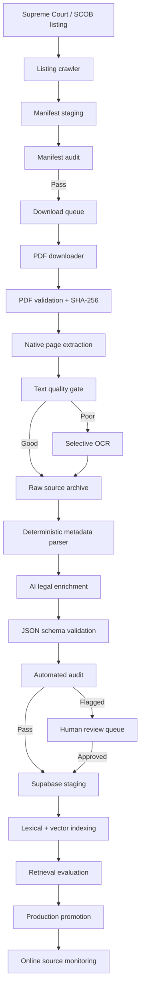

# SCOB Database

**Master Research, Engineering, AI-Assisted Extraction, Audit, and Database-Ingestion Blueprint for Justor AI**

**Prepared for:** Tajuddin Ahamed / Justor AI  
**Prepared on:** 4 August 2026  
**Document status:** Master handoff and implementation specification  
**Recommended use:** Upload this file into any future ChatGPT, Claude, Gemini, Antigravity, Cursor, or coding-agent conversation before asking it to continue the SCOB/Supreme Court database project.

---

## 0. Purpose of This File

This file gives the full context and implementation plan for creating a structured Bangladesh case-law database for Justor AI from:

1. Supreme Court of Bangladesh judgment listings and official judgment PDFs.
2. Supreme Court Online Bulletin (SCOB) issues and reported cases.
3. Future licensed or otherwise lawfully accessible report sources such as DLR, BLD, or BLT.
4. Official Bangladesh legislation used to verify the Acts and sections cited in judgments.

The pipeline covered here is:

```text
Website listing
    ↓
Metadata manifest
    ↓
Official PDF download
    ↓
PDF integrity check
    ↓
Native page-level text extraction
    ↓
Selective OCR when required
    ↓
Raw TXT / Markdown archive
    ↓
Deterministic metadata extraction
    ↓
AI-assisted legal structure extraction
    ↓
JSON schema validation
    ↓
Automated audit
    ↓
Human legal review of flagged/high-value records
    ↓
Supabase/PostgreSQL staging database
    ↓
Embeddings and hybrid retrieval
    ↓
Production promotion
    ↓
Online source and subsequent-history monitoring
```

The core objective is not merely to collect PDFs. The objective is to build:

> **A structured, page-verifiable, source-linked, continuously auditable Bangladesh judgment and reported-case database that lawyers can use for research and Justor AI can use for grounded answers.**

---

# 1. Critical Source Classification

## 1.1 Supreme Court judgment

A PDF linked from the Supreme Court’s Appellate Division or High Court Division judgment listing is an official primary judgment.

Recommended types:

```text
SC_JUDGMENT_AD
SC_JUDGMENT_HCD
```

These judgments may be legally useful and citable, but they are not automatically DLR or SCOB reports.

## 1.2 SCOB

The Supreme Court of Bangladesh describes the **Supreme Court Online Bulletin (SCOB)** as an online law report compiling important judgments from the Appellate Division and High Court Division.

Recommended types:

```text
SCOB_REPORTED_CASE_AD
SCOB_REPORTED_CASE_HCD
SCOB_ISSUE
```

SCOB may include editorial material such as:

- SCOB citation.
- Key words.
- Headnote or proposition.
- Ratio.
- Report page numbers.
- Underlying case number.
- Full or selected judgment text.

The editorial text and judicial text must remain separate.

## 1.3 DLR, BLD, and BLT

These are separate law-reporting publications.

Recommended types:

```text
DLR_REPORTED_CASE
BLD_REPORTED_CASE
BLT_REPORTED_CASE
```

Do not label every official Supreme Court judgment as a DLR case.

## 1.4 One case can have several documents

```text
Canonical case
├── Official Supreme Court judgment
├── Corrected official judgment
├── SCOB version
├── DLR version
├── BLD version
├── BLT version
└── Machine translation
```

These are related manifestations of one case. They are not necessarily duplicates to delete.

## 1.5 Machine translation

The Supreme Court listing may show a Google translation link.

Store it separately:

```text
document_type = MACHINE_TRANSLATION
authority_status = NON_AUTHORITATIVE
```

Never use machine-translated text as the authoritative legal source.

---

# 2. Existing Justor AI Context

Justor AI is a bilingual Bangladesh legal-information platform using retrieval-augmented generation.

The established product direction is:

- Retrieve relevant Bangladesh legal sources before generating an answer.
- Preserve exact statutory and judgment text.
- Provide citations.
- Refuse when the verified source is unavailable.
- Distinguish current, historical, repealed, omitted, and unreviewed material.
- Serve General Public, Law Student, and Legal Professional personas.

Known stack across project documents includes:

```text
Frontend: Vite + TypeScript
Backend: FastAPI / Python
Database: Supabase PostgreSQL
Vector search: pgvector
Deployment: Vercel + Render
```

There is a conflict in older and newer project notes about the current embedding model and dimension:

- Some documents describe Gemini 768-dimensional embeddings.
- Later project memory mentions BGE-M3.
- Older ingestion scripts may have used another model.

**Mandatory rule:** confirm the current production embedding model and dimension before generating case-law embeddings or altering production vector columns.

Until confirmed, store:

```text
embedding_model
embedding_dimension
embedding_version
embedded_at
```

and keep the embedding field nullable.

---

# 3. Evidence and Lessons Already Established

## 3.1 Supreme Court listings expose useful metadata

The official judgment listing contains fields such as:

- Case type.
- Case/tender number.
- Year.
- Parties.
- Short description.
- Uploaded date.
- PDF/detail link.

This makes automatic manifest creation practical.

## 3.2 Uploaded date and judgment date differ

Example:

```text
Uploaded date: 3 August 2026
Judgment date: 12 March 2026
```

Both must be stored separately.

## 3.3 The sample judgment is mixed-language

The uploaded 23-page High Court Division judgment demonstrates:

- English text can often be extracted digitally.
- Bangla passages can become corrupted during extraction.
- Rendered PDF pages may remain readable despite broken extracted text.
- Counsel’s submissions and the court’s reasoning appear in different parts of the judgment.

Therefore:

- A successful parser status does not prove text quality.
- OCR should be selective, not automatic for every page.
- Arguments must not be confused with holdings.
- Page boundaries must be preserved.

## 3.4 Justor’s earlier legal-data work found silent scraper defects

Existing scraped legislation samples have shown problems such as:

- Inserted sections being assigned to the wrong section number.
- Omitted provisions marked Active.
- Amendment notes copied to unrelated sections.
- Duplicate section identifiers.
- Preamble text incorrectly stored as section 1.
- Truncated or malformed source text.

The SCOB/judgment pipeline must therefore include deterministic audits before AI enrichment and ingestion.

---

# 4. Final Tool Decision

## 4.1 Recommended ownership of each task

| Task | Primary tool |
|---|---|
| Listing discovery and pagination | Scrapling or a simple `requests`/BeautifulSoup crawler |
| Resumable large crawl | Scrapling spider |
| PDF downloading | `httpx` or `requests` downloader |
| PDF validation and page text | PyMuPDF |
| Unified PDF/website parsing | Crawl4AI where useful |
| OCR fallback | PyMuPDF OCR/Tesseract or OCRmyPDF |
| JSON validation | Pydantic + JSON Schema |
| AI legal enrichment | Provider-agnostic structured-output LLM |
| Staging ingestion | Supabase Python client or PostgreSQL batch copy |
| Lexical search | PostgreSQL full-text search / PGroonga |
| Semantic search | pgvector |
| Scheduling | Supabase Cron or Render worker |
| Audits | Python scripts + SQL reports |
| Human review | Internal reviewer interface/CLI |

## 4.2 Scrapling’s role

Scrapling is suited to:

- HTML listing pages.
- Concurrent multi-session crawling.
- Pause/resume.
- Checkpoint-based persistence.
- Selector adaptation.
- URL deduplication.
- Structured JSON/JSONL exports.

Use it for the Supreme Court listing and SCOB issue/case index.

Do not use anti-blocking features to defeat an intentional Supreme Court restriction.

## 4.3 Crawl4AI’s role

Crawl4AI is suited to:

- Web extraction.
- CSS/XPath JSON extraction.
- Multi-URL crawling.
- PDF processing from remote or local paths.
- LLM-friendly Markdown.
- Structured output.

Use it as:

- An optional listing extractor.
- A PDF/Markdown extraction path.
- A difficult-page parser.
- A structured extraction helper.

Do not use Crawl4AI LLM extraction as the sole source of raw legal text.

## 4.4 PyMuPDF’s role

Use PyMuPDF as the primary deterministic PDF layer because it can:

- Open and validate PDFs.
- Extract text page by page.
- Preserve page numbers.
- Render selected pages.
- Search page text.
- Use OCR for pages where necessary.

Use:

```python
page.get_text("text", sort=True)
```

as one extraction view, while preserving raw page text and block-level output for debugging.

## 4.5 OCR role

Tesseract is open source and supports many languages, but it does not directly read PDFs. PDF pages must be rendered to images or processed through a wrapper such as OCRmyPDF/PyMuPDF OCR.

Use OCR only when:

- Native text is missing.
- Native text is badly corrupted.
- A page is image-only.
- Bangla characters are visibly lost.
- Important text fails quality checks.

---

# 5. End-to-End System Architecture



---

# 6. Project Folder Structure

```text
scob_database/
├── README.md
├── pyproject.toml
├── requirements.txt
├── .env.example
├── config/
│   ├── sources.yaml
│   ├── selectors.yaml
│   ├── crawl_policy.yaml
│   ├── quality_thresholds.yaml
│   ├── llm_models.yaml
│   └── schemas/
│       ├── manifest.schema.json
│       ├── judgment.schema.json
│       ├── scob_case.schema.json
│       └── analysis.schema.json
├── crawlers/
│   ├── supreme_court_hcd.py
│   ├── supreme_court_ad.py
│   ├── scob_issue_spider.py
│   ├── scob_case_spider.py
│   └── common.py
├── downloader/
│   ├── queue.py
│   ├── download_pdf.py
│   ├── validate_pdf.py
│   └── deduplicate.py
├── extraction/
│   ├── pymupdf_extract.py
│   ├── crawl4ai_extract.py
│   ├── text_blocks.py
│   ├── quality_score.py
│   ├── selective_ocr.py
│   └── normalize.py
├── structuring/
│   ├── metadata_rules.py
│   ├── scob_splitter.py
│   ├── citations.py
│   ├── statutes.py
│   ├── ai_enrichment.py
│   └── models.py
├── audit/
│   ├── manifest_audit.py
│   ├── pdf_audit.py
│   ├── text_audit.py
│   ├── json_audit.py
│   ├── citation_audit.py
│   ├── database_audit.py
│   └── report_builder.py
├── verification/
│   ├── official_source_check.py
│   ├── statute_crosscheck.py
│   ├── case_linker.py
│   ├── subsequent_history.py
│   └── source_hash_monitor.py
├── database/
│   ├── schema.sql
│   ├── migrations/
│   ├── ingest_staging.py
│   ├── promote_production.py
│   └── search_functions.sql
├── evaluation/
│   ├── source_location_test.csv
│   ├── citation_test.csv
│   ├── human_review_tool.py
│   └── metrics.py
├── workers/
│   ├── crawl_worker.py
│   ├── extraction_worker.py
│   ├── enrichment_worker.py
│   └── verification_worker.py
├── data/
│   ├── manifests/
│   ├── pdf/
│   ├── text/
│   ├── markdown/
│   ├── images/
│   ├── json/
│   ├── failed/
│   └── reports/
└── logs/
```

---

# 7. Source Registry

Create a source registry before crawling.

```yaml
sources:
  - source_id: supreme_court_hcd_judgments
    authority: Supreme Court of Bangladesh
    document_type: SC_JUDGMENT_HCD
    base_url: https://www.supremecourt.gov.bd/
    listing_url: REPLACE_WITH_VERIFIED_HCD_LISTING
    allowed_hosts:
      - supremecourt.gov.bd
      - www.supremecourt.gov.bd
    adapter: supreme_court_hcd
    crawl_delay_seconds: 3
    max_concurrency: 2
    requires_review: true

  - source_id: supreme_court_ad_judgments
    authority: Supreme Court of Bangladesh
    document_type: SC_JUDGMENT_AD
    listing_url: REPLACE_WITH_VERIFIED_AD_LISTING
    adapter: supreme_court_ad
    crawl_delay_seconds: 3
    max_concurrency: 2

  - source_id: scob
    authority: Supreme Court of Bangladesh
    document_type: SCOB
    listing_url: https://www.supremecourt.gov.bd/web/?menu=10&page=bulletin.php
    adapter: scob
    crawl_delay_seconds: 3
    max_concurrency: 1
```

Record separately:

- robots.txt review date.
- terms review date.
- technical contact.
- attribution requirements.
- rate limit.
- permitted paths.
- source status.

---

# 8. Stage 1 — Listing Discovery

## 8.1 Goal

Create a complete metadata manifest before downloading PDFs.

## 8.2 Judgment manifest fields

```json
{
  "manifest_id": "BD-SC-HCD-CIVREV-208-2009",
  "source_id": "supreme_court_hcd_judgments",
  "document_type": "SC_JUDGMENT_HCD",
  "division": "High Court Division",
  "case_type": "Civil Revision",
  "case_number": "208",
  "case_year": "2009",
  "full_case_identifier": "Civil Revision No. 208 of 2009",
  "parties_raw": "Sachindra Nath Majumder and others v Asutosh Majumder @ Kundu",
  "short_description_raw": "absolute",
  "uploaded_date": "2026-08-03",
  "listing_url": "OFFICIAL_LISTING_URL",
  "pdf_url": "OFFICIAL_PDF_URL",
  "translation_url": null,
  "discovered_at": "2026-08-04T00:00:00+06:00",
  "crawl_status": "DISCOVERED"
}
```

## 8.3 SCOB issue manifest

```json
{
  "issue_id": "SCOB-18-2023",
  "report_name": "Supreme Court Online Bulletin",
  "issue_number": "18",
  "report_year": "2023",
  "issue_title": "18 SCOB [2023]",
  "issue_pdf_url": "OFFICIAL_URL",
  "listing_url": "OFFICIAL_URL",
  "division_coverage": ["AD", "HCD"],
  "discovered_at": "ISO_TIMESTAMP"
}
```

## 8.4 SCOB case manifest

If the website exposes individual case records:

```json
{
  "scob_case_id": "18-SCOB-2023-HCD-49",
  "scob_citation": "18 SCOB [2023] HCD 49",
  "division": "High Court Division",
  "case_name_raw": "Bangladesh & ors v ...",
  "key_words_raw": "Rejection of plaint; Order VII rule 11...",
  "ratio_raw": "SOURCE EDITORIAL TEXT",
  "case_url": "OFFICIAL_CASE_URL",
  "pdf_url": "OFFICIAL_PDF_URL",
  "issue_id": "SCOB-18-2023"
}
```

## 8.5 Output format

Use JSONL:

```text
one line = one manifest record
```

Also export CSV for manual inspection.

---

# 9. Stage 2 — Manifest Audit

Do not download until the manifest audit passes.

## 9.1 Deterministic checks

- Valid JSON/JSONL.
- Required fields present.
- URL host is approved.
- PDF URL is HTTPS.
- PDF URL is not a Google translation.
- Unique manifest ID.
- Unique source URL or explicitly versioned duplicate.
- Case number and year parsable where available.
- Uploaded date parsable.
- Division identified.
- Document type identified.
- No listing HTML saved as PDF URL.

## 9.2 Reports

```text
01_manifest_summary.csv
02_missing_pdf_urls.csv
03_duplicate_pdf_urls.csv
04_duplicate_case_ids.csv
05_invalid_domains.csv
06_date_parse_failures.csv
07_unknown_case_types.csv
08_division_distribution.csv
09_year_distribution.csv
10_case_type_distribution.csv
```

## 9.3 Stop gate

Do not proceed if:

- More than 2% of records have missing PDF URLs.
- An unapproved domain appears.
- Pagination is incomplete.
- Duplicate handling is undefined.
- Case/year parsing appears shifted.
- Google translation URLs are mixed with official PDFs.

---

# 10. Stage 3 — Resumable Download

## 10.1 Why a separate downloader

A 6,400-file corpus needs:

- Resume support.
- Retry tracking.
- Content hashes.
- Partial file handling.
- Duplicate detection.
- Download logs.
- Respectful pacing.

## 10.2 Download queue schema

```sql
create table download_queue (
    id integer primary key generated always as identity,
    manifest_id text not null,
    pdf_url text not null unique,
    status text not null default 'PENDING',
    priority integer not null default 100,
    attempts integer not null default 0,
    next_attempt_at timestamptz,
    local_path text,
    http_status integer,
    content_type text,
    size_bytes bigint,
    sha256 text,
    etag text,
    last_modified text,
    error_message text,
    created_at timestamptz not null default now(),
    updated_at timestamptz not null default now()
);
```

## 10.3 Status values

```text
PENDING
DOWNLOADING
DOWNLOADED
DUPLICATE_CONTENT
FAILED_RETRYABLE
FAILED_PERMANENT
INVALID_PDF
BLOCKED
```

## 10.4 Safe settings

```text
Concurrent downloads: 1–2
Delay: 2–5 seconds
Timeout: 120 seconds
Retries: 3
Backoff: 5, 15, 45 seconds
```

Start with 25, then 100, then 500, then full corpus.

## 10.5 User-Agent

```text
JustorAI-LegalResearchCrawler/1.0
Contact: a monitored Justor email
Purpose: Indexing publicly available Supreme Court judgments for legal research
```

## 10.6 File naming

```text
{division}_{case_type}_{case_number}_{case_year}_{hash8}.pdf
```

Keep the original filename in metadata.

---

# 11. Stage 4 — PDF Integrity Audit

A HTTP 200 response does not prove a valid judgment PDF.

## 11.1 Checks

- Starts with `%PDF`.
- File can be opened.
- Page count is greater than zero.
- Not encrypted, or encryption status recorded.
- File is not an HTML rejection page.
- File size is reasonable.
- SHA-256 stored.
- Duplicate SHA-256 detected.
- Cross-reference table is readable.
- No unexpected truncation.

## 11.2 PDF report

```text
manifest_id
pdf_url
local_path
sha256
size_bytes
page_count
encrypted
valid
duplicate_of
error
```

---

# 12. Stage 5 — Native PDF-to-Text Extraction

## 12.1 Preserve several representations

For every page, save:

```json
{
  "page_number": 1,
  "raw_text": "...",
  "sorted_text": "...",
  "blocks": [],
  "char_count": 2500,
  "extraction_method": "pymupdf_native",
  "parser_version": "VERSION",
  "quality_status": "UNASSESSED"
}
```

Store:

- Original PDF.
- Page-level TXT.
- Full-document TXT.
- Markdown.
- Text blocks.
- Extraction metadata.
- Parser version.

## 12.2 Why page-level text is mandatory

Lawyers need:

- Exact page references.
- Verifiable quotations.
- Context before and after a proposition.
- Ability to distinguish arguments from findings.

## 12.3 Never overwrite source text

Keep:

```text
raw_native_text
normalized_search_text
ocr_text
selected_display_text
```

as separate fields.

---

# 13. Stage 6 — Text Quality Gate

## 13.1 Metrics

For every page calculate:

- Character count.
- Word/token count.
- Percentage of replacement characters.
- Control-character count.
- Bangla Unicode ratio.
- Latin character ratio.
- Empty-line ratio.
- Repeated header/footer similarity.
- Image count.
- Native text coverage.
- Suspected mojibake.
- Average word length.
- Percentage of suspicious symbols.
- OCR need score.

## 13.2 Suggested classes

```text
PASS_NATIVE
PASS_MINOR_ISSUES
REVIEW_MIXED_LANGUAGE
OCR_CANDIDATE
ENCODING_FAILURE
EMPTY_PAGE
CORRUPT_EXTRACTION
```

## 13.3 Initial threshold example

```python
if char_count >= 500 and replacement_ratio < 0.01:
    status = "PASS_NATIVE"
elif char_count >= 100:
    status = "REVIEW_MIXED_LANGUAGE"
else:
    status = "OCR_CANDIDATE"
```

This is only a starting point. Calibrate it on the first 100 judgments.

---

# 14. Stage 7 — Selective OCR

## 14.1 OCR only flagged pages

```text
Native extraction
    ↓
Quality score
    ↓
Good → use native text
Poor → render page image
    ↓
OCR in Bangla + English
    ↓
Compare native and OCR
    ↓
Select or merge under explicit rules
```

## 14.2 OCR provenance

```json
{
  "page_number": 5,
  "native_text": "...",
  "ocr_text": "...",
  "selected_text": "...",
  "selection_method": "OCR_SELECTED_NATIVE_ENCODING_FAILURE",
  "ocr_languages": ["ben", "eng"],
  "ocr_engine": "tesseract",
  "ocr_version": "VERSION",
  "review_status": "NEEDS_REVIEW"
}
```

## 14.3 Do not silently “correct” names or citations

OCR may alter:

- Party names.
- Case numbers.
- Dates.
- Section numbers.
- Report citations.

High-risk fields require deterministic cross-checks against the PDF and listing metadata.

---

# 15. Stage 8 — SCOB Splitting

SCOB can appear in two structural forms:

## 15.1 Individual case PDF mode

One linked PDF represents one reported case.

Process like a judgment PDF, while preserving:

- SCOB citation.
- Editorial headnote.
- Key words.
- Ratio.
- Report page.

## 15.2 Issue PDF mode

One SCOB issue contains several cases.

Required workflow:

```text
Issue PDF
    ↓
Extract table of contents
    ↓
Identify case start pages
    ↓
Identify division boundary
    ↓
Split into virtual case ranges
    ↓
Create one case record per range
    ↓
Keep issue PDF as parent source
```

## 15.3 Splitting signals

Use a combination of:

- SCOB citation patterns.
- Case names.
- “Appellate Division” / “High Court Division.”
- Court headings.
- Page numbering.
- Contents page.
- Judge names.
- Case-number patterns.
- “Judgment” headings.

## 15.4 AI may assist, but deterministic verification is required

AI can propose start/end pages, but a script must verify:

- No overlapping ranges.
- No missing pages.
- Every contents entry maps to one case.
- First and last pages are plausible.
- Report citation is unique.

---

# 16. Stage 9 — Deterministic Metadata Extraction

Extract with rules before calling an LLM.

## 16.1 Fields

- Court.
- Division.
- Jurisdiction.
- Case type.
- Case number.
- Case year.
- Full case identifier.
- Case name.
- Parties.
- Judge/bench.
- Judgment date.
- Uploaded date.
- Outcome/result from listing.
- Official PDF URL.
- Listing URL.
- Page count.
- File hash.
- SCOB citation.
- Report page.
- Language.
- Extraction status.

## 16.2 Cross-check sources

```text
Listing metadata
vs.
First pages of PDF
vs.
SCOB contents page
vs.
Extracted case text
```

Mismatch examples:

```text
LISTING_PDF_CASE_MISMATCH
DATE_MISMATCH
PARTY_NAME_VARIATION
CASE_NUMBER_MISMATCH
DIVISION_MISMATCH
```

Do not automatically choose one. Store both and flag the mismatch.

---

# 17. Stage 10 — AI-Assisted Legal Enrichment

## 17.1 AI should speed work, not replace source integrity

AI may extract:

- Procedural history.
- Material facts.
- Questions/issues.
- Parties’ submissions.
- Court analysis.
- Holding.
- Ratio decidendi.
- Final order.
- Statutes and sections considered.
- Cases cited.
- Treatment of cited authorities.
- Subject tags.
- Search synonyms.
- Plain-language summary.

## 17.2 AI must not alter

- Raw page text.
- Official citation.
- Case number.
- Judgment date.
- Party names without evidence.
- Original PDF.
- SCOB editorial text.

## 17.3 Every AI field requires support

```json
{
  "holding": {
    "text": "The court held that...",
    "supporting_pages": [14, 15],
    "supporting_quotes": [
      "Short exact passage"
    ],
    "confidence": 0.89,
    "model": "MODEL_ID",
    "prompt_version": "case_enrichment_v1",
    "review_status": "UNREVIEWED"
  }
}
```

## 17.4 Separate speakers

Tag passages:

```text
CASE_BACKGROUND
LOWER_COURT_FINDING
PETITIONER_ARGUMENT
RESPONDENT_ARGUMENT
COURT_ANALYSIS
HOLDING
RATIO
OBITER
FINAL_ORDER
EDITORIAL_HEADNOTE
```

This reduces the risk of presenting counsel’s submission as the court’s law.

## 17.5 Multi-pass AI workflow

### Pass 1 — Structure

Identify page ranges for:

- Heading and metadata.
- Facts/procedural history.
- Arguments.
- Analysis.
- Final order.

### Pass 2 — Citations

Extract:

- Acts.
- Sections.
- Rules/orders.
- Report citations.
- Case names.
- Treatment verbs.

### Pass 3 — Legal analysis

Generate:

- Issues.
- Holding.
- Ratio.
- Outcome.

### Pass 4 — Critic

Ask a second model/pass:

- Is every conclusion supported?
- Are arguments confused with holdings?
- Are citations invented?
- Are page references valid?
- Does the final order match the listing result?

### Pass 5 — Deterministic validator

Reject output if:

- Page number does not exist.
- Citation pattern is invalid.
- Supporting quote is absent from page text.
- Case/section is not found.
- Required field is empty without a reason.

---

# 18. Recommended AI Prompt Contract

## 18.1 System prompt

```text
You are a legal-document extraction engine for Bangladesh court materials.

Use only the supplied page text.
Do not use outside legal knowledge.
Do not invent names, dates, case numbers, citations, statutes, sections, holdings, or page references.
Distinguish counsel submissions, lower-court findings, editorial headnotes, and the deciding court’s reasoning.
Every extracted legal proposition must include supporting page numbers and short exact supporting passages.
If a field is unavailable or uncertain, return null and add a review flag.
Do not rewrite or correct the source text.
Return only JSON that conforms to the supplied schema.
```

## 18.2 Chunking rule

Do not send an entire very long judgment in one prompt.

Use:

```text
Page-aware chunks
+ overlap of 1 page
+ persistent case metadata
+ final synthesis from structured partial outputs
```

## 18.3 AI input package

```json
{
  "case_metadata": {},
  "pages": [
    {
      "page_number": 1,
      "text": "..."
    }
  ],
  "task": "Extract court analysis and final order",
  "allowed_fields": [],
  "schema": {}
}
```

---

# 19. Canonical JSON Schema

## 19.1 Canonical case

```json
{
  "case_id": "BD-SC-HCD-CIVREV-208-2009",
  "case_name": "Sachindra Nath Majumder and others v Asutosh Majumder @ Kundu",
  "court": "Supreme Court of Bangladesh",
  "division": "High Court Division",
  "jurisdiction": "Civil Revisional Jurisdiction",
  "case_type": "Civil Revision",
  "case_number": "208",
  "case_year": "2009",
  "judges": [
    "Md. Riaz Uddin Khan J"
  ],
  "judgment_date": "2026-03-12",
  "subsequent_history_status": "NOT_CHECKED",
  "review_status": "UNREVIEWED"
}
```

## 19.2 Case document

```json
{
  "document_id": "UUID",
  "case_id": "BD-SC-HCD-CIVREV-208-2009",
  "document_type": "SC_JUDGMENT_HCD",
  "reporting_status": "OFFICIAL_UNREPORTED_OR_UNKNOWN",
  "source_authority": "Supreme Court of Bangladesh",
  "official_pdf_url": "URL",
  "listing_url": "URL",
  "uploaded_date": "2026-08-03",
  "pdf_sha256": "HASH",
  "page_count": 23,
  "language": ["eng", "ben"],
  "extraction_status": "PASS_WITH_FLAGS",
  "review_status": "UNREVIEWED"
}
```

## 19.3 SCOB manifestation

```json
{
  "document_type": "SCOB_REPORTED_CASE_HCD",
  "scob_citation": "18 SCOB [2023] HCD 49",
  "issue_id": "SCOB-18-2023",
  "report_start_page": 49,
  "editorial_headnote": {
    "text": "...",
    "source_pages": [49],
    "content_type": "EDITORIAL"
  },
  "judicial_text_pages": []
}
```

## 19.4 Page

```json
{
  "document_id": "UUID",
  "page_number": 11,
  "report_page_number": null,
  "raw_native_text": "...",
  "ocr_text": null,
  "selected_text": "...",
  "quality_status": "PASS_NATIVE",
  "extraction_method": "pymupdf",
  "content_hash": "HASH"
}
```

## 19.5 Legal analysis

```json
{
  "facts": {
    "text": "...",
    "supporting_pages": [2, 3],
    "review_status": "UNREVIEWED"
  },
  "issues": [
    {
      "text": "...",
      "supporting_pages": [10]
    }
  ],
  "holding": {
    "text": "...",
    "supporting_pages": [14, 15]
  },
  "ratio": [
    {
      "text": "...",
      "supporting_pages": [14]
    }
  ],
  "final_order": {
    "text": "...",
    "supporting_pages": [22, 23]
  }
}
```

---

# 20. Citation Extraction

## 20.1 Report patterns

Examples:

```text
57 DLR (AD) 64
33 BLD (AD) 93
7 BLT 164
18 SCOB [2023] HCD 49
```

Store:

```json
{
  "raw_citation": "57 DLR (AD) 64",
  "report": "DLR",
  "division": "AD",
  "volume": "57",
  "year": null,
  "page": "64",
  "source_page": 7,
  "verification_status": "MENTIONED_IN_JUDGMENT"
}
```

“Mentioned in judgment” does not mean independently verified.

## 20.2 Statute citation

```json
{
  "act_name_raw": "Code of Civil Procedure",
  "section_raw": "115(1)",
  "source_page": 1,
  "resolved_act_id": null,
  "resolved_section_id": null,
  "verification_status": "PENDING"
}
```

## 20.3 Treatment

Possible values:

```text
FOLLOWED
APPLIED
RELIED_ON
APPROVED
DISTINGUISHED
DISAPPROVED
OVERRULED
REFERRED_TO
MENTIONED
UNCLEAR
```

Do not infer treatment solely because a case is cited.

---

# 21. Automated Audit Framework

## 21.1 Manifest audit

- Unique source record.
- Valid URL.
- Complete pagination.
- Required metadata.
- No translation contamination.

## 21.2 PDF audit

- Valid PDF.
- Hash.
- Page count.
- Duplicate content.
- Encryption.
- Download completeness.

## 21.3 Text audit

- Text coverage.
- Bangla/English quality.
- Page ordering.
- Header/footer repetition.
- OCR candidates.
- Encoding errors.

## 21.4 JSON audit

- Schema validation.
- Required fields.
- Date formats.
- Unique IDs.
- Page ranges.
- No page references outside document.
- No empty analysis presented as verified.
- No model output in raw source fields.

## 21.5 Legal-support audit

- Holding has support.
- Ratio has support.
- Final order matches source.
- Counsel arguments not labelled as holding.
- SCOB headnote not labelled as court text.
- Statute sections exist in Justor’s law database.
- Citations are syntactically valid.
- Reported citation is not invented.

## 21.6 Database audit

- Staging counts.
- Page count per document.
- Duplicate case keys.
- Orphan pages.
- Orphan citations.
- Missing source URLs.
- Embedding model consistency.
- Review status distribution.

---

# 22. Audit Severity

```text
CRITICAL
HIGH
MEDIUM
LOW
INFO
```

## Critical examples

- Wrong case number.
- Wrong court/division.
- Corrupted final order.
- Invented citation.
- Holding unsupported.
- Source URL outside approved domain.
- Counsel submission presented as holding.
- SCOB headnote mixed into judgment text.

## High examples

- Date mismatch.
- Missing pages.
- OCR errors in legal proposition.
- Duplicate case with conflicting metadata.
- Unverified subsequent history presented as good law.

---

# 23. Human Review Strategy

Do not manually review all documents equally.

## 23.1 Mandatory review

- Critical/high audit flags.
- Appellate Division cases used in answers.
- SCOB ratio/headnote extraction.
- Cases used in professional drafting.
- High-traffic cases.
- OCR-heavy cases.
- Cases with conflicting metadata.
- Cases alleged to overrule or disapprove authority.

## 23.2 Sampling review

For each parser/model version:

- 50 HCD judgments.
- 25 AD judgments.
- 25 SCOB cases.
- Mixed old/new PDFs.
- Mixed English/Bangla.
- Long/short decisions.
- Several case types.

## 23.3 Review labels

```text
UNREVIEWED
AUTO_PASS
NEEDS_REVIEW
LEGAL_REVIEWED
SOURCE_VERIFIED
PRODUCTION_APPROVED
REJECTED
```

---

# 24. Database Design

## 24.1 Core tables

```text
canonical_cases
case_documents
case_pages
case_analysis
case_citations
statute_citations
case_treatment
source_verification
crawl_runs
download_queue
audit_findings
review_events
embedding_jobs
```

## 24.2 Why canonical cases and documents must be separate

A single case can have:

- Official judgment.
- SCOB report.
- DLR report.
- Corrected judgment.

`canonical_cases` stores the dispute/decision identity.

`case_documents` stores each source manifestation.

## 24.3 Example PostgreSQL

```sql
create table canonical_cases (
    id uuid primary key default gen_random_uuid(),
    case_key text unique not null,
    case_name text,
    court text not null,
    division text,
    jurisdiction text,
    case_type text,
    case_number text,
    case_year text,
    judgment_date date,
    subsequent_history_status text not null default 'NOT_CHECKED',
    review_status text not null default 'UNREVIEWED',
    created_at timestamptz not null default now(),
    updated_at timestamptz not null default now()
);

create table case_documents (
    id uuid primary key default gen_random_uuid(),
    case_id uuid references canonical_cases(id),
    document_type text not null,
    source_authority text not null,
    official_url text not null,
    listing_url text,
    reported_citation text,
    uploaded_date date,
    pdf_sha256 text,
    page_count integer,
    language text[],
    extraction_status text,
    review_status text not null default 'UNREVIEWED',
    metadata jsonb not null default '{}'::jsonb,
    unique(document_type, official_url)
);

create table case_pages (
    id uuid primary key default gen_random_uuid(),
    document_id uuid not null references case_documents(id) on delete cascade,
    page_number integer not null,
    report_page_number integer,
    raw_native_text text,
    ocr_text text,
    selected_text text not null,
    quality_status text,
    extraction_method text,
    content_hash text,
    embedding vector,
    embedding_model text,
    embedding_dimension integer,
    metadata jsonb not null default '{}'::jsonb,
    unique(document_id, page_number)
);
```

Do not use `vector` without a dimension in production until the embedding contract is settled; this example emphasizes the unresolved model decision.

---

# 25. Staging-to-Production Workflow

```text
SCRAPED
    ↓
DOWNLOADED
    ↓
EXTRACTED
    ↓
AUTO_AUDITED
    ↓
ENRICHED
    ↓
REVIEWED / AUTO_PASS
    ↓
STAGING_SEARCHABLE
    ↓
RETRIEVAL_TESTED
    ↓
PRODUCTION_APPROVED
```

## 25.1 Never ingest directly into production RAG

Use staging tables or a staging schema.

## 25.2 Promotion criteria

A case can enter production when:

- Official URL is preserved.
- PDF is valid.
- Page count is complete.
- Text quality passes or reviewed OCR exists.
- Case metadata is consistent.
- No critical audit issue exists.
- Legal analysis is clearly marked reviewed/unreviewed.
- Retrieval result cites page-level source.
- Model and embedding version are logged.

---

# 26. Search Architecture

## 26.1 Exact filters first

- Case number.
- Year.
- Division.
- Judge.
- Party.
- SCOB citation.
- Act.
- Section.

## 26.2 Lexical search

Use PostgreSQL full-text search for exact legal language.

For stronger Bangla/multilingual lexical search, investigate PGroonga in Supabase.

## 26.3 Semantic search

Use pgvector for:

- Conceptual legal questions.
- Similar cases.
- Cross-language queries.
- Paraphrased propositions.

## 26.4 Hybrid score

```text
final_score =
    exact_identifier
  + lexical_relevance
  + semantic_similarity
  + court_authority
  + source_quality
  + review_status
  + recency where relevant
```

## 26.5 Retrieval unit

Recommended retrieval units:

- Page.
- Court-analysis paragraph.
- Final order.
- SCOB ratio/headnote.
- Citation context.

Do not chunk blindly by fixed characters when page and legal structure are available.

---

# 27. Lawyer-Facing Result

```text
Case:
Sachindra Nath Majumder and others v Asutosh Majumder @ Kundu

Court:
High Court Division

Case:
Civil Revision No. 208 of 2009

Judge:
Md. Riaz Uddin Khan J

Judgment date:
12 March 2026

Uploaded:
3 August 2026

Document:
Official Supreme Court judgment

Reported citation:
Not identified

Relevant pages:
11–16

Subsequent history:
Not checked

Verification:
Official source verified; AI analysis unreviewed
```

Every proposition should show:

- Exact source.
- Page.
- Supporting passage.
- Analysis status.
- Subsequent-history warning.

---

# 28. Online Cross-Verification

## 28.1 Source integrity

On a schedule:

- Re-open listing.
- Confirm case still exists.
- Confirm PDF URL.
- Recalculate PDF hash.
- Detect corrections/replacements.
- Record last verified date.

## 28.2 Statute verification

Resolve cited Acts and sections against Justor’s official legislation index.

Return:

```text
ACTIVE
AMENDED
OMITTED
REPEALED
NOT_FOUND
AMBIGUOUS
```

## 28.3 Report-citation verification

If DLR/BLD/BLT is not available under licence or lawful access:

```text
Mentioned in official judgment
Independent report verification unavailable
```

## 28.4 Subsequent history

Eventually detect:

- Appeal.
- Leave petition.
- Review.
- Stay.
- Reversal.
- Overruling.
- Later treatment.

Until verified:

```text
SUBSEQUENT_HISTORY_NOT_CHECKED
```

---

# 29. AI Efficiency Strategy

## 29.1 Use AI only where it adds value

### No AI required

- Listing extraction.
- PDF downloading.
- Hashing.
- Page counting.
- Exact case identifiers.
- JSON validation.
- Duplicate detection.
- Basic citation regex.
- Database ingestion.

### AI useful

- Complex party-role parsing.
- Facts/issues.
- Holding/ratio.
- Speaker classification.
- Subject tags.
- Citation treatment.
- Anomaly triage.
- Review prioritization.

## 29.2 Batch priority

```text
1. SCOB
2. Appellate Division
3. Recent/high-value HCD cases
4. Cases frequently cited by other judgments
5. Remaining HCD corpus
```

## 29.3 Cache AI results

Cache using:

```text
document_hash
+ page-range hash
+ prompt_version
+ model_id
+ schema_version
```

Do not pay/process twice when the source and prompt are unchanged.

## 29.4 Model routing

Use a small/cheap model for:

- Classification.
- Tagging.
- Citation extraction.

Use a stronger model for:

- Ratio.
- Holding.
- Complex multi-page synthesis.

Use a critic model/pass only for high-risk outputs.

---

# 30. Cost-Control Strategy

A largely free local pipeline is possible.

## Free/local components

- Scrapling.
- Crawl4AI.
- PyMuPDF.
- Tesseract.
- PostgreSQL.
- SQLite.
- Local file storage.
- Local validation scripts.
- Local LLM if hardware permits.

## Costs likely to appear later

- Cloud storage.
- Larger Supabase database.
- AI enrichment.
- OCR compute.
- Backups.
- Monitoring.
- Legal review.
- Production hosting.

## Strongest cost control

Do not AI-process every page immediately.

Process:

```text
raw source for all
basic metadata for all
AI enrichment for priority cases
human review for flagged/high-use cases
```

---

# 31. Pilot Plan

## Batch 1 — 25 documents

Include:

- HCD.
- AD.
- SCOB.
- Bangla and English.
- Short and long.
- Modern and older.
- Native-text and scanned-looking.

## Batch 2 — 100 documents

Measure:

- Manifest accuracy.
- Download success.
- Page extraction.
- OCR rate.
- Metadata accuracy.
- AI support accuracy.
- Cost and time.

## Batch 3 — 500 documents

Test:

- Resume.
- Queue.
- Duplicate handling.
- Database load.
- Retrieval.
- Monitoring.

## Batch 4 — full source

Proceed only after gates pass.

---

# 32. One-Day 200-Case Target

Within one day, the realistic deliverable is:

- 200 official PDF downloads.
- SHA-256 hashes.
- Page counts.
- Page-level native text.
- Basic metadata JSON.
- Staging ingestion.
- Audit report.
- Lexical search.

Not realistic in one day:

- Lawyer-verified ratio for 200 cases.
- Subsequent-history checking.
- Full OCR correction.
- DLR/SCOB cross-linking for every case.
- Production-grade citation treatment.

---

# 33. Estimated Timeline

## Proof of concept

```text
3–7 days
```

## Reliable 200–500 case pipeline

```text
1–3 weeks
```

## Full 6,400 judgment raw corpus

```text
3–6 weeks part-time/one developer
```

## SCOB splitting, enrichment, search, and review

```text
4–10 additional weeks
```

## Lawyer-ready mature case platform

```text
2–4 months or longer
```

The timeline depends on:

- Site structure.
- PDF quality.
- Bangla OCR rate.
- Engineering time.
- Legal review capacity.
- AI provider limits.

---

# 34. Security

## 34.1 Domain allowlist

Only approved hosts.

## 34.2 SSRF protection

- HTTPS only.
- Reject private IPs.
- Validate redirects.
- Limit redirects.
- Restrict MIME types.
- Limit file size.
- No arbitrary user URLs.

## 34.3 Prompt injection

Treat page/PDF text as data, not instructions.

Do not expose tool permissions or credentials to document content.

## 34.4 Secrets

- Backend environment variables.
- Never frontend keys.
- Separate development and production keys.
- Usage quotas.
- Rotation.

---

# 35. Operational Monitoring

Dashboard:

```text
Listings discovered
PDFs downloaded
Download failures
Invalid PDFs
Duplicate hashes
Pages extracted
OCR candidates
JSON failures
Critical audit findings
Pending human review
Cases promoted
Embedding jobs
Broken official links
Changed PDF hashes
```

Alerts:

- Website structure changes.
- Sudden extraction failure.
- Source hash changes.
- Provider quota.
- Critical citation failures.
- Unapproved domain.

---

# 36. Required Reports

```text
01_manifest_summary.csv
02_download_summary.csv
03_download_failures.csv
04_duplicate_urls.csv
05_duplicate_hashes.csv
06_invalid_pdfs.csv
07_extraction_quality.csv
08_ocr_candidates.csv
09_metadata_mismatches.csv
10_json_schema_failures.csv
11_citation_audit.csv
12_statute_resolution.csv
13_review_queue.csv
14_database_counts.csv
15_retrieval_evaluation.csv
16_cost_and_latency.csv
17_final_readiness_report.md
```

---

# 37. Go/No-Go Gates

## Go to staging

- 95%+ successful PDF acquisition for selected batch.
- No unapproved domains.
- Valid hashes.
- Complete page records.
- Known OCR candidates flagged.
- Basic metadata reasonably accurate.
- No critical schema errors.

## Go to production search

- Critical findings resolved.
- Page citations work.
- No invented citation IDs.
- Source links open.
- Review labels visible.
- Retrieval evaluated.
- Subsequent-history warning shown.
- Production embedding contract confirmed.

## No-go

- AI summary replaces source.
- Counsel argument becomes holding.
- SCOB editorial text becomes judicial text.
- Missing pages are ignored.
- Unverified DLR citation is invented.
- Live PDF changes overwrite history.
- Staging is mixed into production without audit.

---

# 38. Antigravity Coding-Agent Master Prompt

Copy everything below into Antigravity after attaching this file.

```text
You are the lead data engineer and legal-document pipeline engineer for Justor AI.

Read the attached “SCOB Database” master file completely before writing code.

GOAL
Build a production-oriented, resumable pipeline that:
1. crawls approved Supreme Court of Bangladesh judgment and SCOB listing pages;
2. creates a metadata manifest;
3. audits the manifest;
4. downloads official PDFs safely and slowly;
5. validates and hashes each PDF;
6. extracts exact page-level text;
7. selectively OCRs only failed/corrupted pages;
8. creates raw TXT, Markdown, and schema-valid JSON;
9. performs deterministic metadata and citation extraction;
10. optionally performs AI legal enrichment with page-level support;
11. generates audit reports;
12. ingests only into Supabase staging tables;
13. supports later promotion to production.

NON-NEGOTIABLE RULES
- Never bypass robots, blocks, or rate limits.
- Approved domains only.
- Do not scrape all documents before passing 25, 100, and 500-document gates.
- Preserve original PDFs and SHA-256 hashes.
- Preserve exact page-level text.
- Do not overwrite native text with OCR.
- Keep SCOB editorial headnotes separate from judicial text.
- Keep counsel arguments separate from court analysis.
- Do not invent DLR/SCOB/BLD/BLT citations.
- Do not use model memory for legal fields.
- Every AI conclusion requires supporting pages and exact short passages.
- Use null and review flags instead of guesses.
- Use JSONL for manifests.
- Use staging tables, never production document_chunks.
- Do not generate embeddings until the production embedding model/dimension is confirmed.
- Every task must be resumable and idempotent.
- Every script must have structured logging, type hints, error handling, and tests.

IMPLEMENTATION ORDER
Phase 1:
- inspect the actual HTML;
- document pagination and selectors;
- create source config and manifest crawler;
- create manifest audit;
- run on 25 documents;
- stop and report.

Phase 2:
- create SQLite/Postgres queue;
- create safe downloader;
- add PDF validation and SHA-256;
- run on 100 documents;
- stop and report.

Phase 3:
- add PyMuPDF page extraction;
- add text-quality scoring;
- add selective OCR interface;
- output page-level JSON;
- stop and report.

Phase 4:
- add Pydantic models and JSON Schema;
- add deterministic metadata/citation parsers;
- add audit reports;
- add Supabase staging schema and batch ingestion.

Phase 5:
- add provider-agnostic AI enrichment;
- add page-supported fields;
- add critic validation;
- add caching by document hash + prompt version + model.

Phase 6:
- add SCOB issue splitting and case linkage;
- add canonical_cases / case_documents model;
- add lexical and vector retrieval only after approval.

DELIVERABLES
- complete repository;
- README with Windows instructions;
- .env.example;
- source/selector configuration;
- SQL schema;
- tests;
- sample output for 25 cases;
- audit report;
- known limitations;
- exact next commands.

Do not claim completion unless the test run artifacts prove it.
Ask me only for information that cannot be determined by inspecting the supplied sources.
```

---

# 39. AI Legal-Enrichment Prompt

```text
SYSTEM

You extract structured information from Bangladesh court judgments and SCOB reports.

SOURCE RULES
- Use only the supplied page text and supplied metadata.
- Do not use outside knowledge.
- Do not invent or silently correct.
- Separate editorial text, counsel submissions, lower-court findings, and the deciding court’s reasoning.
- Every legal conclusion must include supporting page numbers and short exact supporting passages.
- If uncertain, return null and a review flag.
- Return valid JSON only.

TASK
Extract:
1. procedural history;
2. material facts;
3. legal issues;
4. petitioner/appellant arguments;
5. respondent arguments;
6. court analysis;
7. holding;
8. ratio decidendi;
9. obiter, only if clearly identifiable;
10. final order;
11. statutes and sections;
12. cited cases and raw report citations;
13. treatment of cited cases;
14. subject tags.

VALIDATION RULES
- Supporting pages must exist.
- Supporting passages must appear verbatim in the supplied text.
- Do not label a submission as a holding.
- Do not label a SCOB headnote as judicial reasoning.
- Do not create a reported citation that is absent.
- “Not found” is acceptable.
```

---

# 40. AI Audit Prompt

```text
You are auditing a structured case JSON against exact page-level source text.

Return only an audit JSON.

Check:
- case number;
- division;
- parties;
- judge;
- judgment date;
- uploaded date;
- outcome;
- page count;
- SCOB citation;
- every statute/section;
- every reported citation;
- facts;
- issues;
- holding;
- ratio;
- final order;
- supporting page numbers;
- supporting quotes;
- separation of arguments and court findings;
- separation of editorial and judicial text.

For every problem return:
- severity: CRITICAL/HIGH/MEDIUM/LOW;
- field;
- problem;
- source page;
- JSON value;
- source evidence;
- recommended action.

Do not rewrite the source.
Do not approve an unsupported conclusion.
```

---

# 41. Future-Chat Research Prompt

Copy this into a new research chat with this file attached:

```text
Read the attached “SCOB Database” file completely.

Act as a senior legal-data architect, Python crawling engineer, RAG engineer, and Bangladesh case-law database researcher.

Research and verify the current official documentation and source structure for:
- Supreme Court of Bangladesh judgment listings;
- Supreme Court Online Bulletin;
- Scrapling;
- Crawl4AI;
- PyMuPDF/PyMuPDF4LLM;
- Tesseract/OCRmyPDF;
- Supabase/PostgreSQL;
- pgvector;
- multilingual full-text search;
- current robots/terms and source accessibility.

Then:
1. identify anything outdated or unsupported in the attached blueprint;
2. map the exact Supreme Court/SCOB pagination and PDF-link structure;
3. recommend a final source adapter design;
4. create a 25-document test plan;
5. create exact Pydantic models;
6. create a final PostgreSQL staging schema;
7. create audit rules;
8. estimate time, storage, AI cost, and human review;
9. identify legal, copyright, privacy, and operational risks;
10. return a revised implementation plan.

Use primary/official sources for technical claims.
Clearly separate verified facts, inferences, and recommendations.
Do not overclaim accuracy or legal status.
```

---

# 42. Open Decisions

1. Exact Appellate Division listing URL.
2. Exact High Court Division pagination parameters.
3. Whether SCOB provides individual case PDFs, issue PDFs, or both for every issue.
4. The first 25-document sample.
5. Current Justor embedding model and dimension.
6. Whether original PDFs will remain local, object storage, or official-link-only.
7. Who approves legal analysis.
8. How much unreviewed AI analysis can be shown to professionals.
9. Third-party report licensing strategy.
10. Subsequent-history verification strategy.
11. Monthly AI and storage budget.
12. Whether PGroonga is enabled for Bangla lexical search.

---

# 43. Recommended Immediate Next Actions

## Today

1. Save this file in the Justor project repository.
2. Create a fresh Git branch.
3. Inspect the actual SCOB and judgment HTML in browser developer tools.
4. Confirm pagination and link patterns.
5. Select 25 documents.
6. Give the Antigravity prompt to the coding agent.
7. Require the agent to stop after the first audit report.

## This week

1. Complete 25-document extraction.
2. Review five PDFs page by page.
3. Measure Bangla corruption.
4. Finalize schemas.
5. Process 100 documents.
6. Ingest into staging.
7. Test lawyer-style search queries.

## After the first 100

1. Fix systematic errors.
2. Process 500.
3. Add AI enrichment.
4. Add human-review interface.
5. Add SCOB splitting.
6. Prepare full-corpus run.

---

# 44. Official and Primary References for Continued Research

- Supreme Court of Bangladesh SCOB landing page:  
  https://www.supremecourt.gov.bd/web/?menu=10&page=bulletin.php

- Scrapling official GitHub repository:  
  https://github.com/D4Vinci/Scrapling

- Crawl4AI official GitHub repository:  
  https://github.com/unclecode/crawl4ai

- Crawl4AI official documentation:  
  https://docs.crawl4ai.com/

- Crawl4AI PDF parsing:  
  https://docs.crawl4ai.com/advanced/pdf-parsing/

- PyMuPDF documentation:  
  https://pymupdf.readthedocs.io/

- PyMuPDF text extraction:  
  https://pymupdf.readthedocs.io/en/latest/recipes-text.html

- PyMuPDF OCR:  
  https://pymupdf.readthedocs.io/en/latest/recipes-ocr.html

- Tesseract documentation:  
  https://tesseract-ocr.github.io/tessdoc/

- Supabase pgvector:  
  https://supabase.com/docs/guides/database/extensions/pgvector

- Supabase full-text search:  
  https://supabase.com/docs/guides/database/full-text-search

- Supabase automatic embeddings:  
  https://supabase.com/docs/guides/ai/automatic-embeddings

- Supabase Cron:  
  https://supabase.com/docs/guides/cron

- pgvector official repository:  
  https://github.com/pgvector/pgvector

---

# 45. Final Position

The project should not be framed as:

> “Download PDFs, ask AI to summarize them, and upload the JSON.”

The correct framing is:

> **Create an auditable legal-source supply chain in which official PDFs are discovered, preserved, validated, converted page by page, selectively OCRed, structured with deterministic and AI-assisted methods, reviewed according to risk, ingested into staging, evaluated for citation accuracy, and only then promoted into Justor’s production legal research system.**

The source PDF and page text are the foundation.

AI is an accelerator for classification, enrichment, anomaly detection, and review prioritization—not the authority and not the source of legal truth.
