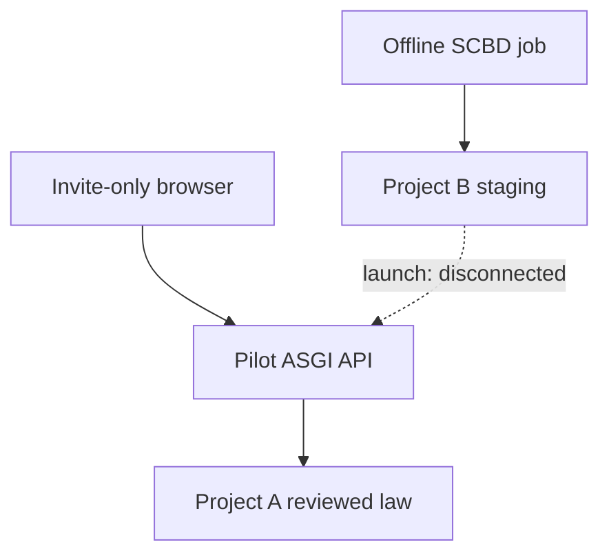

# Justor AI two-day closed-pilot release gate

## Decision as of 2026-08-12

**NO-GO for participant launch.** The current workspace is a statically valid,
substantially implemented engineering release candidate, not a deployed or
legally approved pilot. “90%” is not an accuracy claim or a verified completion
percentage: the remaining work contains the human, database, deployment, and
live-browser gates that decide whether launch is safe.

The reviewed boundary is admin-invite only. Start with a 10-account dry run
(5 citizens, 3 law students, and 2 lawyers), then expand in controlled invite
waves if the gates stay healthy. Citizen answers are property-only and
deterministic from lawyer-reviewed cards. Student/lawyer research can return
exact reviewed statutes, not free synthesis. Tax is clarify/abstain-only.
Supreme Court collection is a separate offline staging job, and case retrieval
is OFF at launch.

## Current evidence

The strict verifier was last run in the current uncommitted workspace with these
results:

| Check | Result |
|---|---:|
| Python unit tests | 34 passed, 0 failed, 0 skipped |
| Offline acceptance cases | 27/27 passed |
| Live acceptance cases | 0/14 supplied |
| Total acceptance contract | 41 cases |
| Frontend production build | passed |
| Current npm dependency audit | 0 vulnerabilities |
| SQL files parsed | 6/6 |
| Pinned Python dependencies | matched |
| Tesseract languages | `eng`, `osd`; **`ben` missing** |
| Package validity | true |
| Release readiness | **false** |

Static verification is evidence about code/package contracts only. It cannot
approve legal text, database state, Auth settings, deployed headers/routes,
participant consent, or browser behavior.

## Implemented launch boundary



- `render.yaml` now starts `pilot_release_v1.backend.asgi:create_app`, not the
  legacy backend monolith, and installs only the web-runtime lock.
- The API exposes only authenticated chat and run-linked feedback, with strict
  schemas, backend-owned membership/capabilities, current consent/expiry,
  transaction-safe rate limits, explicit CORS, request-size limits, generic
  errors, no docs, and no model-provider fallback.
- Project A SQL separates candidates, immutable official sources, exact
  provision versions, citizen scope approvals, evidence-bound reviewed cards,
  status cards, privacy-minimized runs, feedback ownership, rate limits, and an
  owner-only retention function. Browser and legacy chat grants are revoked.
- The frontend requires a verified account and keeps chat text in browser
  session memory. It has no guest entry, open public signup, OAuth
  self-enrollment, upload/document/case/upgrade/voice controls, third-party
  scripts, or browser keep-alive. Model Markdown is sanitized; source links use
  trusted metadata and an official-host allowlist.
- The SCBD pipeline respectfully discovers/downloads official PDFs, resumes only
  with validators, enforces file/corpus/page caps, preserves listing snapshots
  and page hashes, separates weak OCR, supports deterministic single/map-reduce
  extraction, and keeps all generated records in staging pending two distinct
  human reviews.
- Legal scope includes the Registration (Amendment) Act, 2026, Act No. 14 of
  2026. The official amendment changed the reviewed companion rules, including
  the current section 17A presentation period, section 26, section 52A, and new
  section 77A. See the [official amendment Act](https://bdlaws.minlaw.gov.bd/act-1643.html)
  and [current section 17A](https://bdlaws.minlaw.gov.bd/act-90/section-22918.html).
  Registration Act section 23 itself is three months; its distinct companion
  rules must not be collapsed. See [current section 23](https://bdlaws.minlaw.gov.bd/act-90/section-22926.html).

## Reproduce package verification

Use an isolated QA environment; do not install SCBD dependencies into the web
image.

```bash
python -m venv .venv-verify
. .venv-verify/bin/activate
python -m pip install \
  -r pilot_release_v1/requirements-pilot.txt \
  -r pilot_release_v1/requirements-scbd.txt \
  -r pilot_release_v1/requirements-verify.txt
npm ci
python pilot_release_v1/scripts/verify_release.py \
  --root pilot_release_v1 --static-only
```

The verifier performs a current npm registry audit of runtime and build
dependencies, so registry access is part of release verification. A failed or
unavailable audit makes the package invalid rather than silently passing.

`--static-only` may exit zero when `package_valid` is true, but always reports
`release_ready: false`. The actual release command is strict and must receive
fresh live evidence (24 hours old or less by default):

```bash
python pilot_release_v1/scripts/verify_release.py \
  --root pilot_release_v1 \
  --evidence-dir /ABSOLUTE/PATH/TO/RELEASE_EVIDENCE
```

Until every live result is a documented PASS and Bengali OCR is installed, the
strict command must exit nonzero.

## Mandatory launch sequence

1. Separate these pilot changes from unrelated working-tree edits. Review the
   full diff, create one immutable commit, push it, and put that exact SHA in
   `JUSTOR_APP_COMMIT`. Do not deploy base commit `83638f2`; it starts the old
   architecture.
2. In Project A, confirm the dashboard project/reference and a restorable
   backup; disable open public sign-up; save
   `project_a_preflight_audit.sql` output.
3. Apply `project_a_000_legacy_lockdown.sql`, then
   `project_a_001_invite_pilot.sql`, only to Project A. Run and save
   `project_a_postflight.sql`.
4. Source and independently lawyer-review the ten target property provisions,
   their required companions, statement evidence, translations, dates/status,
   and ten runtime cards. Candidate rows and model checks are not approval.
5. Invite the first ten named accounts for dry-run evidence. Record current
   counsel-approved consent, exact consent version, cohort capabilities,
   activation, and expiry. Keep `case_search` absent. After clean evidence,
   add more named accounts through admin invite batches; never open public
   signup.
6. Deploy the new backend and frontend with only the documented variables.
   Prove the old backend/routes are unreachable and built assets contain no
   secrets.
7. Execute all 14 live cases from `evaluation/PILOT_ACCEPTANCE.md`, including
   Auth denial, rate limit, XSS, database ownership, legal-card behavior, case
   isolation, resume behavior, promotion exclusion, and telemetry linkage.
8. Run the ten-account scripted dry run. A named CTO/release owner and the two
   legal reviewers sign the evidence and make a fresh GO/NO-GO decision for the
   first invite wave.

Project B is not a launch dependency. If the team chooses to stage cases during
the two days, confirm a different project and backup, apply only the Project B
migration there, run its postflight, and keep the application disconnected.

## Two-day operator schedule

| Window | Owner | Exit condition |
|---|---|---|
| Day 1, 0–2 h | Engineering/security | Clean reviewed commit; static verifier reproducible |
| Day 1, 2–4 h | Project A owner | Backup/preflight, migrations, zero-row postflight gates |
| Day 1, 4–10 h | Two lawyers + students | Ten exact sources/companions/cards signed; 2026 amendment covered |
| Day 1, 10–12 h | Backend/deployment | New ASGI origin live; legacy origin/routes unavailable |
| Day 2, 0–3 h | Frontend/security | Clean build, headers/secrets audit, deployed XSS evidence |
| Day 2, 3–7 h | QA/legal | All 14 live gates PASS or release remains NO-GO |
| Day 2, 7–9 h | Data operator, optional | Bengali OCR plus two-document SCBD smoke; no promotion |
| Day 2, 9–11 h | Ten participants | Scripted dry run with consent/access/case isolation |
| Day 2, 11–12 h | CTO + lawyers | Evidence review and signed GO/NO-GO |

## Non-negotiable gates

Zero security failures; 100% unsupported/adversarial abstention; 100% source,
hash, quote, and feedback ownership integrity; 100% citizen isolation from
Project B; at least 90% scoped routing/exact retrieval on the frozen set; ten
lawyer-reviewed property cards; clean first-wave consent/capability allocation;
and no unreviewed current-law statement.

Do not advertise 80%/90% accuracy, production readiness, “Harvey-level” quality,
or “zero hallucinations.” The historical benchmark is roughly 33% and remains
the honest baseline until a frozen, blinded, lawyer-graded evaluation replaces
it.
